---
---
# Pattern Relationship Network

A comprehensive visualization of interconnections across all 50+ patterns in the Cross-Disciplinary Software Team Spaces pattern language.

## Complete Pattern Network

```mermaid
graph TD
    %% Meta-Patterns (Foundation Layer)
    HCD[Human-Centric Design]
    SEI[Spaces that Empower and Invite]
    TOC[Transparency and Osmotic Communication]
    FALA[Fractal Autonomy, Layered Alignment]
    RCF[Rhythms of Collaboration and Focus]
    PTP[Productive Traces Preservation]

    %% Architectural-Spatial Patterns
    %% Macro-Scale
    WCC[Work Community Clusters]
    SWC[Scattered Work and Campus Layout]
    OCT[Office Connections & Team War Rooms]
    ACD[Accessible & Code-Compliant Design]
    NES[Neighborhood Effect and Serendipity]

    %% Micro-Scale
    STB[Small Team Bays]
    WEP[Workspace Enclosure & Personal Space]
    HOH[Half-Open, Half-Private Spaces]
    ECP[Environmental Comfort Patterns]
    PHS[Personalization and Human Scale]
    VET[Visible Evolution Traces]

    %% Collaborative
    PPW[Pair Programming Workstations]
    MPC[Mob Programming Corner]
    ASP[Adjacent Semi-Private Spaces]
    CB[Call Booths]

    %% Organizational Patterns
    %% Team Structure
    SGT[Self-Governing Teams]
    AA[Aligned Autonomy]
    DMP[Decision-Making Patterns]
    TCS[Team Composition and Size]
    RST[Right-Sized Stream-Aligned Teams]
    DFT[Demand-Led Fluid Teaming]

    %% Decision-Making
    OTD[One-Way vs Two-Way Door Decisions]
    CDF[Cynefin-Based Decision Framework]
    SE[Structured Experiments]
    TO[Trying Out Options]
    NGT[Nominal Group Technique]
    RV[Ranked Voting]
    ADR[Architecture Decision Records]

    %% Communication
    DSU[Daily Stand-Ups]
    SRP[Swarm Reviews & Pairing]
    TA[Transparent Artifacts]
    PSP[Psychological Safety Practices]
    OSS[Open Space Swarm Cadence]
    TOL[Thinking Out Loud]
    IIT[I Intend To]
    DPR[Desire Path Recognition]
    MRA[Meeting Room Anti-Pattern]
    IZC[In-Zone Collaboration]

    %% Cross-Team
    PTC[Platform Teams & Communities of Practice]
    CTS[Cross-Team Synchronization]
    TAPI[Team API]
    ECR[Embedded Coordination Roles]
    EPT[Enabling and Platform Teams]
    NSG[Near/Far Specialist Guilds]

    %% Hybrid Work
    HFD[Handbook First Documentation]
    ACN[Async Collaboration Norms]
    AD[Anchor Days]
    DCV[Digital Campfires & Virtual Watercoolers]
    DW[Distributed Whiteboards]
    HKN[Hybrid Coordination Knowledge Networks]
    ETS[Embedded Telepresence Team Spaces]
    BPM[Blameless Post-Mortems]

    %% Cross-Disciplinary Patterns
    %% Research Lab
    SEC[Shared Equipment Core]
    PS[Poster Sessions]
    LA[Lab Adjacency]

    %% Maker Space
    MFR[Modular Furniture and Reconfigurability]
    DOW[Display of Work]
    TA2[Toolbelt Availability]

    %% Studio
    PUS[Pin-Up Space]
    CR[Critique Rituals]
    MT[Materiality and Texture]

    %% Manufacturing
    UTL[U-Shape Team Layout]
    ACS[Andon Cord & Stop-the-Line]
    KC[Kaizen Corner]

    %% Temporal Patterns
    %% Daily/Weekly
    CHT[Core Hours & Temporal Zoning]
    DR[Daily Rituals]
    WC[Weekly Cadence]
    NMT[No-Meeting Time]

    %% Longer-Term
    MMR[Monthly/4-Month Period Rituals]
    THC[Team Health Checks]
    ASP2[Annual/Seasonal Patterns]

    %% Space-Time
    RSA[Rituals as Spatial Anchors]
    CE[Communal Eating]
    CTE[Cross-Team Events]

    %% Meta-Pattern Relationships (Foundation)
    HCD --> PSP
    HCD --> WEP
    HCD --> SEI
    SEI --> PHS
    SEI --> PSP
    SEI --> SGT
    TOC --> TA
    TOC --> NES
    TOC --> HOH
    FALA --> AA
    FALA --> SGT
    FALA --> PTC
    RCF --> CHT
    RCF --> NMT
    RCF --> DR
    PTP --> VET
    PTP --> PHS

    %% Architectural-Spatial Relationships
    %% Macro to Micro
    WCC --> STB
    WCC --> NES
    SWC --> WCC
    SWC --> NES
    OCT --> STB
    OCT --> WCC
    OCT --> HOH
    NES --> WCC
    NES --> SWC
    NES --> CE
    NES --> MRA
    NES --> ASP

    %% Micro-Scale Interconnections
    STB --> WCC
    STB --> WEP
    STB --> SGT
    STB --> PPW
    STB --> MPC
    STB --> UTL
    STB --> ETS
    WEP --> HOH
    WEP --> STB
    WEP --> ECP
    HOH --> WEP
    HOH --> STB
    HOH --> ECP
    HOH --> ASP
    HOH --> CB
    ECP --> ACD
    ECP --> WEP
    ECP --> PHS
    ECP --> PPW
    ECP --> MPC
    ECP --> STB
    ECP --> PSP
    ECP --> THC
    PHS --> ECP
    PHS --> WEP
    PHS --> DOW
    PHS --> VET
    PHS --> PTP
    VET --> PHS
    VET --> DOW
    VET --> KC

    %% Collaborative Space Relationships
    PPW --> STB
    PPW --> MFR
    PPW --> UTL
    PPW --> ECP
    MPC --> PPW
    MPC --> STB
    MPC --> MFR
    MPC --> ECP
    MPC --> UTL
    ASP --> HOH
    ASP --> STB
    ASP --> MRA
    ASP --> MFR
    ASP --> CB
    CB --> HOH
    CB --> STB
    CB --> MRA
    CB --> ASP
    CB --> ECP
    CB --> CHT
    CB --> ACN

    %% Organizational Pattern Relationships
    %% Team Structure
    SGT --> AA
    SGT --> RST
    SGT --> TAPI
    SGT --> EPT
    AA --> SGT
    AA --> TAPI
    AA --> PTC
    AA --> RST
    TCS --> SGT
    TCS --> STB
    TCS --> CTS
    RST --> EPT
    RST --> TAPI
    RST --> SGT
    RST --> AA
    DFT --> AA
    DFT --> PTC
    DFT --> RST
    DFT --> OSS

    %% Decision-Making Flows
    DMP --> OTD
    DMP --> CDF
    DMP --> SE
    DMP --> NGT
    DMP --> RV
    DMP --> ADR
    DMP --> TOL
    DMP --> IIT
    DMP --> AA
    DMP --> SGT
    DMP --> TA
    OTD --> SE
    OTD --> DMP
    OTD --> AA
    OTD --> ADR
    CDF --> OTD
    CDF --> SE
    CDF --> DMP
    CDF --> PSP
    SE --> OTD
    SE --> CDF
    SE --> TO
    SE --> ADR
    TO --> SE
    TO --> OTD
    TO --> CDF
    TO --> ADR
    NGT --> RV
    NGT --> PSP
    NGT --> CDF
    NGT --> SE
    RV --> NGT
    RV --> SE
    RV --> DMP
    RV --> PSP
    ADR --> OTD
    ADR --> SE
    ADR --> TA
    ADR --> IIT

    %% Communication Patterns
    DSU --> TA
    DSU --> PSP
    DSU --> AD
    SRP --> OSS
    SRP --> HKN
    SRP --> TA
    SRP --> PSP
    TA --> DSU
    TA --> DOW
    TA --> DW
    PSP --> BPM
    PSP --> THC
    PSP --> HCD
    TOL --> IIT
    TOL --> PSP
    TOL --> TA
    TOL --> DSU
    IIT --> TOL
    IIT --> ADR
    IIT --> TA
    IIT --> PSP
    MRA --> ASP
    MRA --> CB
    MRA --> NES
    MRA --> IZC
    MRA --> SRP
    IZC --> ASP
    IZC --> MRA
    IZC --> STB
    IZC --> TA
    IZC --> SRP

    %% Cross-Team Coordination
    PTC --> AA
    PTC --> CTS
    PTC --> TAPI
    CTS --> AA
    CTS --> CTE
    CTS --> ECR
    TAPI --> RST
    TAPI --> EPT
    TAPI --> HKN
    TAPI --> AA
    ECR --> CTS
    ECR --> TAPI
    ECR --> PTC
    EPT --> RST
    EPT --> TAPI
    EPT --> NSG
    EPT --> SGT
    NSG --> EPT
    NSG --> PTC
    NSG --> RST
    NSG --> SGT

    %% Hybrid Work Integration
    HFD --> ACN
    HFD --> TA
    HFD --> DCV
    ACN --> HFD
    ACN --> DW
    ACN --> DCV
    AD --> DCV
    AD --> CE
    AD --> CTE
    DCV --> AD
    DCV --> CE
    DCV --> ACN
    DW --> SRP
    DW --> TA
    DW --> PUS
    HKN --> DW
    HKN --> ACN
    HKN --> AD
    HKN --> TAPI
    ETS --> PPW
    ETS --> MPC
    ETS --> STB
    ETS --> DCV
    ETS --> HKN
    BPM --> PSP
    BPM --> TA
    BPM --> THC

    %% Cross-Disciplinary Connections
    %% Research Lab
    SEC --> TA2
    SEC --> LA
    SEC --> NES
    PS --> DOW
    PS --> PUS
    PS --> CTE
    LA --> SEC
    LA --> NES
    LA --> WCC

    %% Maker Space
    MFR --> PPW
    MFR --> MPC
    MFR --> DOW
    MFR --> PHS
    MFR --> UTL
    DOW --> PS
    DOW --> PUS
    DOW --> TA
    DOW --> VET
    DOW --> PTP
    TA2 --> SEC
    TA2 --> DOW
    TA2 --> MFR

    %% Studio
    PUS --> DOW
    PUS --> PS
    PUS --> CR
    CR --> PUS
    CR --> PS
    CR --> PSP
    CR --> WC
    CR --> RSA
    MT --> PHS
    MT --> ECP
    MT --> DOW

    %% Manufacturing
    UTL --> STB
    UTL --> PPW
    UTL --> MPC
    UTL --> MFR
    UTL --> HOH
    ACS --> PSP
    ACS --> SRP
    ACS --> KC
    KC --> TA
    KC --> DOW
    KC --> ACS

    %% Temporal Pattern Integration
    %% Daily/Weekly Rhythms
    CHT --> NMT
    CHT --> DR
    CHT --> ACN
    DR --> DSU
    DR --> CHT
    DR --> RSA
    WC --> DR
    WC --> MMR
    WC --> CTE
    NMT --> CHT
    NMT --> DR
    NMT --> ACN

    %% Longer-Term Cycles
    MMR --> WC
    MMR --> CTE
    MMR --> THC
    THC --> PSP
    THC --> MMR
    THC --> TCS
    ASP2 --> MMR
    ASP2 --> CTE
    ASP2 --> AD

    %% Space-Time Integration
    RSA --> DR
    RSA --> CE
    RSA --> PUS
    CE --> NES
    CE --> DCV
    CE --> RSA
    CTE --> CTS
    CTE --> PS
    CTE --> MMR

    %% Style Definitions
    classDef metaPattern fill:#e1f5fe,stroke:#01579b,stroke-width:3px
    classDef architecturalMacro fill:#f3e5f5,stroke:#4a148c,stroke-width:2px
    classDef architecturalMicro fill:#fce4ec,stroke:#880e4f,stroke-width:2px
    classDef organizationalTeam fill:#e8f5e8,stroke:#1b5e20,stroke-width:2px
    classDef organizationalDecision fill:#fff3e0,stroke:#e65100,stroke-width:2px
    classDef organizationalComm fill:#e0f2f1,stroke:#004d40,stroke-width:2px
    classDef crossDisciplinary fill:#fff8e1,stroke:#ff6f00,stroke-width:2px
    classDef temporal fill:#f1f8e9,stroke:#33691e,stroke-width:2px

    %% Apply Styles
    class HCD,SEI,TOC,FALA,RCF,PTP metaPattern
    class WCC,SWC,OCT,ACD,NES architecturalMacro
    class STB,WEP,HOH,ECP,PHS,VET,PPW,MPC,ASP,CB architecturalMicro
    class SGT,AA,DMP,TCS,RST,DFT organizationalTeam
    class OTD,CDF,SE,TO,NGT,RV,ADR organizationalDecision
    class DSU,SRP,TA,PSP,OSS,TOL,IIT,DPR,MRA,IZC,PTC,CTS,TAPI,ECR,EPT,NSG,HFD,ACN,AD,DCV,DW,HKN,ETS,BPM organizationalComm
    class SEC,PS,LA,MFR,DOW,TA2,PUS,CR,MT,UTL,ACS,KC crossDisciplinary
    class CHT,DR,WC,NMT,MMR,THC,ASP2,RSA,CE,CTE temporal
```

## Key Network Insights

### Central Hub Patterns
The most connected patterns that serve as integration points:

1. **[Small Team Bays](architectural-spatial/small-team-bays.md)** (15+ connections) - Physical foundation for team autonomy
2. **[Psychological Safety Practices](organizational/psychological-safety-practices.md)** (12+ connections) - Cultural foundation across all categories
3. **[Transparent Artifacts](organizational/transparent-artifacts.md)** (11+ connections) - Information flow enabler
4. **[Self-Governing Teams](organizational/self-governing-teams.md)** (10+ connections) - Organizational autonomy foundation

### Cross-Category Bridges
Patterns that strongly connect different categories:

- **[Environmental Comfort Patterns](architectural-spatial/environmental-comfort-patterns.md)** → Bridges physical design with team wellbeing
- **[Daily Rituals](temporal/daily-rituals.md)** → Connects temporal patterns with organizational practices
- **[Display of Work](cross-disciplinary/display-of-work.md)** → Links cross-disciplinary practices with organizational transparency
- **[Modular Furniture and Reconfigurability](cross-disciplinary/modular-furniture-reconfigurability.md)** → Connects cross-disciplinary flexibility with spatial adaptability

### Pattern Clusters

#### High-Autonomy Cluster
- [Self-Governing Teams](organizational/self-governing-teams.md)
- [Small Team Bays](architectural-spatial/small-team-bays.md) 
- [Aligned Autonomy](organizational/aligned-autonomy.md)

#### Transparency Cluster  
- [Transparent Artifacts](organizational/transparent-artifacts.md)
- [Display of Work](cross-disciplinary/display-of-work.md)
- [Neighborhood Effect and Serendipity](architectural-spatial/neighborhood-effect-serendipity.md)

#### Hybrid Integration Cluster
- [Anchor Days](organizational/anchor-days.md)
- [Digital Campfires & Virtual Watercoolers](organizational/digital-campfires-virtual-watercoolers.md)
- [Embedded Telepresence in Team Spaces](organizational/embedded-telepresence-team-spaces.md)

#### Decision Quality Cluster
- [Cynefin-Based Decision Framework](organizational/cynefin-based-decision-framework.md)
- [Structured Experiments](organizational/structured-experiments.md)
- [Architecture Decision Records](organizational/architecture-decision-records.md)

### Implementation Pathways

#### Foundation First
1. Start with **[Meta-Patterns](meta-patterns/)** for philosophical alignment
2. Establish **[Psychological Safety Practices](organizational/psychological-safety-practices.md)**
3. Implement **[Self-Governing Teams](organizational/self-governing-teams.md)**

#### Spatial Support
1. Create **[Small Team Bays](architectural-spatial/small-team-bays.md)** 
2. Add **[Adjacent Semi-Private Spaces](architectural-spatial/adjacent-semi-private-spaces.md)**
3. Enable **[Modular Furniture and Reconfigurability](cross-disciplinary/modular-furniture-reconfigurability.md)** for adaptability

#### Communication Flow
1. Implement **[Transparent Artifacts](organizational/transparent-artifacts.md)**
2. Establish **[Daily Stand-Ups](organizational/daily-stand-ups.md)**
3. Create **[Display of Work](cross-disciplinary/display-of-work.md)** areas

#### Hybrid Integration
1. Set up **[Anchor Days](organizational/anchor-days.md)**
2. Install **[Embedded Telepresence in Team Spaces](organizational/embedded-telepresence-team-spaces.md)**
3. Develop **[Async Collaboration Norms](organizational/async-collaboration-norms.md)**

---

*This network visualization reveals the pattern language as a complex adaptive system where individual patterns gain strength through their interconnections. Use this map to understand dependencies, identify implementation sequences, and discover unexpected pattern combinations that might benefit your team environment.*