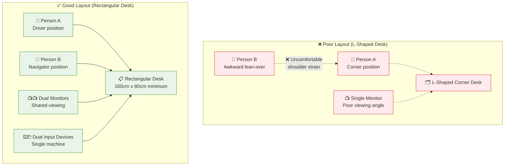

---
---
# Pair Programming Workstations

## Summary
Design dedicated desks for two people to comfortably work at one machine. These workspaces promote collaborative coding through ergonomic shared design.

## Context
Modern software development increasingly relies on pair programming for knowledge sharing, code quality, and team learning. However, most office furniture is designed for individual work. This makes pair programming awkward and physically uncomfortable.

## Problem
Traditional L-shaped desks, corner workstations, and narrow desks force pairing partners into uncomfortable positions. They must lean over shoulders, share inadequate space, or struggle with limited access to peripherals. This physical discomfort discourages pair programming and reduces its effectiveness.

## Solution
Create dedicated pair programming workstations with:

**Desk Design:**
- Long, straight-edged desks (minimum 160×80 cm) with no corner obstructions
- Rectangular layout that allows a second chair to sit side-by-side easily
- Height-adjustable surfaces or platforms to accommodate different preferences
- Sufficient depth for dual monitors and adequate working space

**Equipment Configuration:**
- Two-user, one-machine setup with dual monitors, keyboards, and mice
- Both peripherals connected to a single computer for seamless control transfer
- Large monitors (24" minimum) positioned for comfortable viewing by both users
- Cable management to prevent workspace clutter

**Seating and Ergonomics:**
- Two adjustable task chairs that can be positioned side-by-side
- Optional bar-height stools for standing collaboration
- Adequate legroom and personal space for extended sessions

## Visual Layout

### Optimal Pair Programming Desk Configuration
```
                    ← 160cm minimum width →
                   ┌─────────────────────────┐ ↑
                   │      MONITOR  MONITOR   │ │
                   │        📺      📺      │ │
                   │                         │ │ 80cm
                   │  ⌨️🖱️         ⌨️🖱️    │ │ min
                   │ PERSON A      PERSON B  │ │ depth
                   │   🪑           🪑       │ │
                   └─────────────────────────┘ ↓
                   
                   ← Driver Position  Navigator Position →
```

### Driver/Navigator Setup
```
        📺 SHARED DISPLAY (24" minimum) 📺
        ┌─────────────────────────────────┐
        │                                 │
        │    Code + Collaborative View    │
        │                                 │
        └─────────────────────────────────┘
        
    ⌨️ KEYBOARD A          ⌨️ KEYBOARD B
    🖱️ MOUSE A             🖱️ MOUSE B
        ↓                       ↓
    [PERSON A]               [PERSON B]
     Driver                   Navigator
    🪑 Chair A               🪑 Chair B
    
    💻 ONE MACHINE (switch control via software)
    
    Both keyboards/mice connected to single computer
    Easy role switching without standing/moving
```

### Alternative Standing Configuration
```
                    🏃‍♂️ STANDING HEIGHT 🏃‍♀️
                   ┌─────────────────────────┐
                   │  📺 MONITOR  MONITOR 📺 │
                   │                         │
                   │  ⌨️ KEYBOARD KEYBOARD ⌨️ │
                   │  🖱️ MOUSE    MOUSE   🖱️ │
                   │                         │
                   │  👤 PERSON A  PERSON B 👤│
                   └─────────────────────────┘
                   
                   Optional bar stools: 🪑      🪑
                   (for hybrid sit/stand sessions)
```

### Equipment Layout Comparison


### Space Requirements Within Team Bays
```
    TEAM BAY INTEGRATION (within Small Team Bays pattern)
    
    ┌─────────────────────────────────────────────────────┐
    │  INDIVIDUAL    │   PAIR STATION   │  INDIVIDUAL     │
    │  WORKSTATION   │                  │  WORKSTATION    │
    │      👤         │    👤 + 👤       │      👤         │
    │     🖥️🪑        │   📺📺⌨️⌨️🪑🪑   │     🖥️🪑        │
    │                 │                  │                 │
    ├─────────────────┼──────────────────┼─────────────────┤
    │                                                     │
    │            TEAM COLLABORATION AREA                   │
    │                ○ Standing Table                     │
    │                                                     │
    ├─────────────────┼──────────────────┼─────────────────┤
    │  INDIVIDUAL    │   INDIVIDUAL     │  INDIVIDUAL     │
    │  WORKSTATION   │   WORKSTATION    │  WORKSTATION    │
    │      👤         │      👤          │      👤         │
    │     🖥️🪑        │     🖥️🪑         │     🖥️🪑        │
    └─────────────────┴──────────────────┴─────────────────┘
    
    Pair programming workstation takes ~20% more space
    but enables intensive collaboration when needed
```

## Forces
- **Collaboration vs. Individual Work:** Stations must support intensive pairing while remaining usable for solo development
- **Physical Comfort:** Extended pairing sessions require ergonomic consideration for both participants
- **Equipment Sharing:** Technical setup must enable smooth role transitions between driver and navigator
- **Space Efficiency:** Dedicated pairing stations require more floor space than individual workstations

## Examples
- **Fog Creek Software:** Used extra-long rectangular desks instead of L-shaped ones to invite pairing partners without awkward positioning
- **Thoughtworks:** Implemented wide bench-style desks that could accommodate two developers comfortably
- **Modern Agile Offices:** Mobile workstations on wheels that can be combined for pairing or separated for focus work

## Related Patterns
- [Small Team Bays](small-team-bays.md) - Can house multiple pair programming workstations
- [Modular Furniture and Reconfigurability](../cross-disciplinary/modular-furniture-reconfigurability.md) - Supports flexible pairing arrangements
- [U-Shape Team Layout](../cross-disciplinary/u-shape-team-layout.md) - Can incorporate pairing pods within team clusters
- [Environmental Comfort Patterns](environmental-comfort-patterns.md) - Ensures physical comfort during extended collaboration

## Sources
- Beck, Kent. "Extreme Programming Explained: Embrace Change"
- Fog Creek Software office design case studies
- Agile workspace research on collaboration-friendly furniture
- Ergonomic studies on shared workstation design