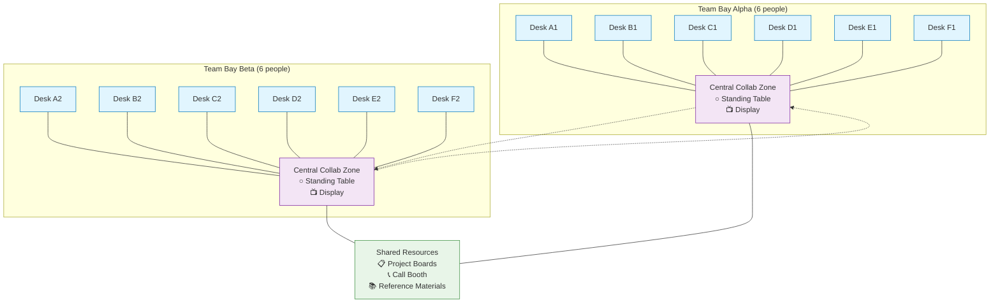

---
---
# Small Team Bays

## Summary
Create team bays for typically 4-6 people, with a maximum of a dozen achieved by joining two adjacent bays, featuring good sound dampening to encourage natural conversation.

## Context
Team workspace design that balances collaboration needs with focus requirements and human-scale social interaction.

## Problem
Large open offices create noise, distraction, and anonymity. People lose sense of team identity and struggle to concentrate or communicate effectively. Teams also need to feel comfortable talking naturally without worrying about disturbing others.

## Solution
Create small team bays that:
- **Optimal sizing**: Typically 4-6 people per bay for ideal team dynamics
- **Dimensional specifications**: 300-400 sq ft (28-37 m²) for 4-6 person bay, 600-800 sq ft (56-74 m²) for joined double bay up to 12 people
- **Individual workspace**: 60-80 sq ft (5.6-7.4 m²) per person including circulation space, with minimum 6 feet (1.8m) between facing desks
- **Central collaboration zone**: 100-150 sq ft (9-14 m²) for team interactions
- **Scalable design**: Larger teams (up to 12) accommodated by joining two adjacent bays
- **Partial enclosure**: Low walls (4-5 feet/1.2-1.5m) or barriers that define the space but maintain visual connection
- **Superior sound dampening**: Acoustic treatment that prevents conversation from carrying while allowing teams to speak naturally
- **Shared resources**: Team whiteboard, meeting corner, shared storage
- **Team identity**: Space that the team can personalize and control
- **Adjacent quiet**: Access to phone booths or quiet areas for private work

**Collaborative Layout Design:**
- **U-shaped desk arrangement**: Individual workstations around bay perimeter facing walls, with open central area for team interaction
- **Central collaboration zone**: Large shared table or standing bench in the middle of the U-shape for quick huddles and pair rotations
- **Multiple work modes**: Support for individual focus (at personal desks), pair programming (shared stations), and team meetings (central area)
- **Information radiators**: Ample wall space for sprint boards, whiteboards, and design artifacts to create "mission control" environment

**Meeting and Display Infrastructure:**
- **Stand-up area**: Central space with round standing-height table to encourage brief, energetic meetings
- **Large display**: Wall-mounted screen or projector for group code reviews, demos, and video calls
- **Telepresence integration**: Video conferencing setup for hybrid team participation
- **Flexible furniture**: Mobile whiteboards and modular seating that can be reconfigured for different activities

## Visual Layout

### Single Team Bay (4-6 people)
```
                   ┌─────────────────────────────────────────┐
                   │              WALL/DISPLAY                │
                   └─────────────────────────────────────────┘
                   
    ┌─────────┐                                       ┌─────────┐
    │  DESK   │                                       │  DESK   │
    │    A    │                                       │    B    │
    └─────────┘                                       └─────────┘
         ↑                                                 ↑
      PERSON                                            PERSON
      
    ┌─────────┐     ┌─────────────────────────┐       ┌─────────┐
    │  DESK   │     │     COLLABORATION       │       │  DESK   │
    │    F    │     │        ZONE             │       │    C    │
    └─────────┘     │   ○ STANDING TABLE      │       └─────────┘
         ↑          │   ⚬ MOBILE CHAIRS       │            ↑
      PERSON        │   📺 SHARED SCREEN      │         PERSON
                    └─────────────────────────┘
    ┌─────────┐                                       ┌─────────┐
    │  DESK   │                                       │  DESK   │
    │    E    │                                       │    D    │
    └─────────┘                                       └─────────┘
         ↑                                                 ↑
      PERSON                                            PERSON
                   
                   ┌─────────────────────────────────────────┐
                   │          STORAGE/WHITEBOARD             │
                   └─────────────────────────────────────────┘
```

### Extended Bay for Larger Teams (8-12 people)


## Forces
- Small groups develop stronger cohesion and trust
- Communication overhead grows non-linearly with team size
- People need territorial comfort and belonging
- Teams need identity and shared artifacts
- Concentration requires freedom from excessive noise
- Collaboration requires easy communication
- Teams must feel comfortable talking naturally without fear of disturbing others

## Implementation Checklist

### Phase 1: Space Planning & Design (Weeks 1-3)
**Prerequisites:**
- [ ] Authority to modify physical workspace
- [ ] Budget for furniture and acoustic treatments
- [ ] Commitment to team-based work organization

**Space Assessment:**
- [ ] Measure available floor area (minimum 300-400 sq ft for 4-6 person bay)
- [ ] Verify natural light access for all workstations (Norwegian compliance)
- [ ] Check HVAC capacity for occupancy levels
- [ ] Assess electrical and network infrastructure needs
- [ ] Identify emergency egress and accessibility requirements

**Layout Design:**
- [ ] Plan U-shaped desk arrangement around bay perimeter
- [ ] Reserve central collaboration zone (100-150 sq ft)
- [ ] Position team workspace for visual connection while maintaining focus
- [ ] Plan wall space for information radiators and displays
- [ ] Ensure sight lines to shared resources and call booths

### Phase 2: Acoustic & Environmental Setup (Weeks 2-4)
**Sound Management:**
- [ ] Install acoustic panels or low walls (4-5 feet height) with NRC 0.85+ rating
- [ ] Test background noise levels (target: <50 dB for concentration, <40 dB for phone calls)
- [ ] Achieve Speech Privacy Index (SPI) of 0.7-0.8 (allows team conversation while protecting from external distraction)
- [ ] Add carpet or sound-absorbing flooring materials (minimum NRC 0.25)
- [ ] Install acoustic ceiling tiles (NRC 0.70-0.90) if possible
- [ ] Position fabric-wrapped acoustic barriers with dense core (fiberglass/rockwool) to contain team discussions
- [ ] Consider white noise or sound masking systems if ambient noise insufficient
- [ ] Verify speech privacy without complete isolation - teams should overhear urgent cross-team communications

**Environmental Comfort:**
- [ ] Install adjustable LED lighting (minimum 500 lux on work surfaces)
- [ ] Ensure individual climate control or acceptable temperature range (68-75°F)
- [ ] Verify air circulation meets occupancy requirements
- [ ] Add plants or biophilic elements for stress reduction
- [ ] Test that each workstation has access to natural light

### Phase 3: Furniture & Technology (Weeks 3-5)
**Individual Workstations:**
- [ ] Install height-adjustable desks (sit-stand capability)
- [ ] Provide ergonomic chairs with full adjustability
- [ ] Set up dual monitors per workstation (minimum 24" displays)
- [ ] Ensure adequate power and USB connectivity
- [ ] Configure network access and wireless coverage

**Collaboration Infrastructure:**
- [ ] Install central standing-height table or shared surface
- [ ] Mount large shared display (minimum 55" for team of 6)
- [ ] Set up video conferencing system for hybrid participation
- [ ] Provide mobile whiteboards and flip charts
- [ ] Add modular seating for flexible arrangements

**Storage & Organization:**
- [ ] Install shared storage for team materials
- [ ] Set up individual storage (drawer units, lockers)
- [ ] Create space for personal items and team artifacts
- [ ] Install wall-mounted whiteboard or pin-up surfaces
- [ ] Organize cable management and power distribution

### Phase 4: Team Integration & Optimization (Weeks 4-8)
**Team Onboarding:**
- [ ] Orient team to new space layout and capabilities
- [ ] Establish team norms for space usage and noise levels
- [ ] Train team on collaboration technology and tools
- [ ] Create team working agreements for shared space
- [ ] Allow team to personalize and adapt space

**Usage Optimization:**
- [ ] Monitor space utilization patterns for 2-4 weeks
- [ ] Gather team feedback on comfort and functionality
- [ ] Adjust furniture placement based on actual usage
- [ ] Fine-tune acoustic and lighting based on team needs
- [ ] Document successful configurations for other teams

### Success Indicators
**Immediate (Week 1-2):**
- [ ] Team can work without distraction from other teams
- [ ] Natural conversation flows without external disruption
- [ ] Quick transitions between individual and collaborative work
- [ ] All team members have comfortable, ergonomic workstations

**Short-term (Month 1-2):**
- [ ] Increased informal collaboration and knowledge sharing
- [ ] Reduced time spent looking for meeting rooms
- [ ] Team members express satisfaction with space comfort
- [ ] Observable team identity and ownership of space

**Medium-term (Month 2-6):**
- [ ] Evidence of team customization and adaptation of space
- [ ] Effective hybrid participation in team activities
- [ ] Measured improvement in team collaboration metrics
- [ ] Space serves as model for other team implementations

### Measurements & Validation
**Quantitative Metrics:**
- [ ] Acoustic measurements: <50 dB background, speech privacy index >0.7
- [ ] Lighting levels: 500+ lux on work surfaces, glare reduction
- [ ] Space utilization: >80% occupancy during core hours
- [ ] Team satisfaction scores: >4/5 for comfort and collaboration

**Qualitative Assessment:**
- [ ] Team reports feeling more connected and collaborative
- [ ] Reduced complaints about noise and distractions
- [ ] Visible team artifacts and personalization
- [ ] Natural leadership and self-organization emergence

### Common Issues & Solutions
- [ ] **Noise bleeding**: Add acoustic barriers or adjust team placement
- [ ] **Insufficient collaboration**: Redesign central area or add mobile furniture
- [ ] **Technology problems**: Ensure adequate power, network, and A/V support
- [ ] **Space conflicts**: Establish clear team boundaries and usage norms
- [ ] **Limited personalization**: Allow teams to modify and adapt within guidelines

## Team Transition Protocols

### When Team Composition Changes
Team bays must adapt when members join, leave, or when entirely new teams occupy the space:

**Adding Team Members (1-2 people):**
- [ ] Assess if current bay can accommodate growth within 4-6 person optimal range
- [ ] Reconfigure furniture layout to maintain U-shape while adding workstations
- [ ] Preserve central collaboration zone (minimum 100 sq ft)
- [ ] Update technology access (network, power, display connections)
- [ ] Allow 1-2 weeks for team to establish new working patterns

**Major Team Changes (>50% turnover):**
- [ ] Conduct space reset session with incoming team members
- [ ] Review and potentially modify team working agreements for space usage
- [ ] Reestablish team identity artifacts (displays, decorations, project boards)
- [ ] Test and adjust acoustic properties if team interaction style differs
- [ ] Allow 4-6 weeks for new team dynamics to stabilize

**Complete Team Replacement:**
- [ ] Archive previous team's work artifacts and personalization appropriately
- [ ] Reset space to neutral baseline while preserving successful layout elements
- [ ] Orient new team to space capabilities and constraints
- [ ] Support new team in establishing ownership and customization
- [ ] Monitor space usage patterns during first 8 weeks for optimization needs

### Space Evolution Guidelines
**Gradual Adaptation (Ongoing):**
- [ ] Allow teams to move furniture within acoustic and safety constraints
- [ ] Support seasonal or project-based reconfigurations
- [ ] Maintain documentation of successful layout variations for future teams
- [ ] Preserve core U-shape structure while allowing collaboration zone flexibility

**Major Reconfiguration (Quarterly/Project-based):**
- [ ] Assess whether current team size still fits optimal bay capacity
- [ ] Consider joining/splitting bays if team dynamics have fundamentally changed
- [ ] Update technology infrastructure if new work modes require different setups
- [ ] Coordinate with facilities management for structural or system changes

### Handover Documentation
**For Teams Leaving Bay:**
- [ ] Document successful furniture configurations and layout optimizations
- [ ] Identify which acoustic treatments and environmental settings worked best
- [ ] Note any technology setup nuances or equipment preferences
- [ ] Capture lessons learned about space usage patterns and team dynamics

**For Teams Entering Bay:**
- [ ] Provide space capability overview and constraint documentation
- [ ] Share previous team's successful configuration insights (if relevant)
- [ ] Explain acoustic boundaries and noise etiquette with neighboring teams
- [ ] Orient to shared resources and collaboration infrastructure

## Examples
- Wells (1960s) studies showing preference for smaller office groupings
- Basecamp's quiet team areas with "library rules"
- Agile team bays in software companies with acoustic treatment
- Alexander's research on optimal work group sizes

## Related Patterns
- [Work Community Clusters](work-community-clusters.md) - Small team bays are components of larger clusters
- [Workspace Enclosure & Personal Space](workspace-enclosure-personal-space.md) - Provides individual territory within team space
- [Self-Governing Teams](../organizational/self-governing-teams.md) - Organizational pattern supported by dedicated team space
- [Pair Programming Workstations](pair-programming-workstations.md) - Can be integrated into team bay layout
- [Mob Programming Corner](mob-programming-corner.md) - Central collaboration area serves this function
- [U-Shape Team Layout](../cross-disciplinary/u-shape-team-layout.md) - Specific implementation of team bay arrangement
- [Embedded Telepresence in Team Spaces](../organizational/embedded-telepresence-team-spaces.md) - Technology integration for hybrid teams

## Sources
- Christopher Alexander, "A Pattern Language" (Pattern 148)
- Wells office preference studies (1960s)
- Tom DeMarco and Timothy Lister, "Peopleware"
- Agile workspace design literature