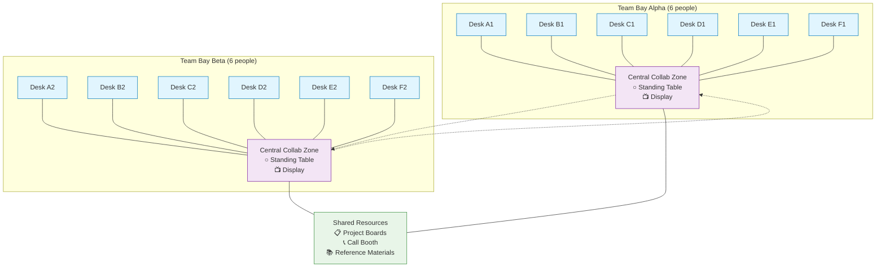

# Small Team Bays

## Summary
Create team bays for typically 4-6 people, with a maximum of a dozen achieved by joining two adjacent bays, featuring good sound dampening to encourage natural conversation.

## Context
Team workspace design that balances collaboration needs with focus requirements and human-scale social interaction.

## Problem
Large open offices create noise, distraction, and anonymity. People lose sense of team identity and struggle to concentrate or communicate effectively. Teams also need to feel comfortable talking naturally without worrying about disturbing others.

## Solution
Create small team bays that:
- **Optimal sizing**: Typically 4-6 people per bay for ideal team dynamics
- **Scalable design**: Larger teams (up to 12) accommodated by joining two adjacent bays
- **Partial enclosure**: Low walls or barriers that define the space but maintain visual connection
- **Superior sound dampening**: Acoustic treatment that prevents conversation from carrying while allowing teams to speak naturally
- **Shared resources**: Team whiteboard, meeting corner, shared storage
- **Team identity**: Space that the team can personalize and control
- **Adjacent quiet**: Access to phone booths or quiet areas for private work

**Collaborative Layout Design:**
- **U-shaped desk arrangement**: Individual workstations around bay perimeter facing walls, with open central area for team interaction
- **Central collaboration zone**: Large shared table or standing bench in the middle of the U-shape for quick huddles and pair rotations
- **Multiple work modes**: Support for individual focus (at personal desks), pair programming (shared stations), and team meetings (central area)
- **Information radiators**: Ample wall space for sprint boards, whiteboards, and design artifacts to create "mission control" environment

**Meeting and Display Infrastructure:**
- **Stand-up area**: Central space with round standing-height table to encourage brief, energetic meetings
- **Large display**: Wall-mounted screen or projector for group code reviews, demos, and video calls
- **Telepresence integration**: Video conferencing setup for hybrid team participation
- **Flexible furniture**: Mobile whiteboards and modular seating that can be reconfigured for different activities

## Visual Layout

### Single Team Bay (4-6 people)
```
                   ┌─────────────────────────────────────────┐
                   │              WALL/DISPLAY                │
                   └─────────────────────────────────────────┘
                   
    ┌─────────┐                                       ┌─────────┐
    │  DESK   │                                       │  DESK   │
    │    A    │                                       │    B    │
    └─────────┘                                       └─────────┘
         ↑                                                 ↑
      PERSON                                            PERSON
      
    ┌─────────┐     ┌─────────────────────────┐       ┌─────────┐
    │  DESK   │     │     COLLABORATION       │       │  DESK   │
    │    F    │     │        ZONE             │       │    C    │
    └─────────┘     │   ○ STANDING TABLE      │       └─────────┘
         ↑          │   ⚬ MOBILE CHAIRS       │            ↑
      PERSON        │   📺 SHARED SCREEN      │         PERSON
                    └─────────────────────────┘
    ┌─────────┐                                       ┌─────────┐
    │  DESK   │                                       │  DESK   │
    │    E    │                                       │    D    │
    └─────────┘                                       └─────────┘
         ↑                                                 ↑
      PERSON                                            PERSON
                   
                   ┌─────────────────────────────────────────┐
                   │          STORAGE/WHITEBOARD             │
                   └─────────────────────────────────────────┘
```

### Extended Bay for Larger Teams (8-12 people)


## Forces
- Small groups develop stronger cohesion and trust
- Communication overhead grows non-linearly with team size
- People need territorial comfort and belonging
- Teams need identity and shared artifacts
- Concentration requires freedom from excessive noise
- Collaboration requires easy communication
- Teams must feel comfortable talking naturally without fear of disturbing others

## Examples
- Wells (1960s) studies showing preference for smaller office groupings
- Basecamp's quiet team areas with "library rules"
- Agile team bays in software companies with acoustic treatment
- Alexander's research on optimal work group sizes

## Related Patterns
- [Work Community Clusters](work-community-clusters.md) - Small team bays are components of larger clusters
- [Workspace Enclosure & Personal Space](workspace-enclosure-personal-space.md) - Provides individual territory within team space
- [Self-Governing Teams](../organizational/self-governing-teams.md) - Organizational pattern supported by dedicated team space
- [Pair Programming Workstations](pair-programming-workstations.md) - Can be integrated into team bay layout
- [Mob Programming Corner](mob-programming-corner.md) - Central collaboration area serves this function
- [U-Shape Team Layout](../cross-disciplinary/u-shape-team-layout.md) - Specific implementation of team bay arrangement
- [Embedded Telepresence in Team Spaces](../organizational/embedded-telepresence-team-spaces.md) - Technology integration for hybrid teams

## Sources
- Christopher Alexander, "A Pattern Language" (Pattern 148)
- Wells office preference studies (1960s)
- Tom DeMarco and Timothy Lister, "Peopleware"
- Agile workspace design literature