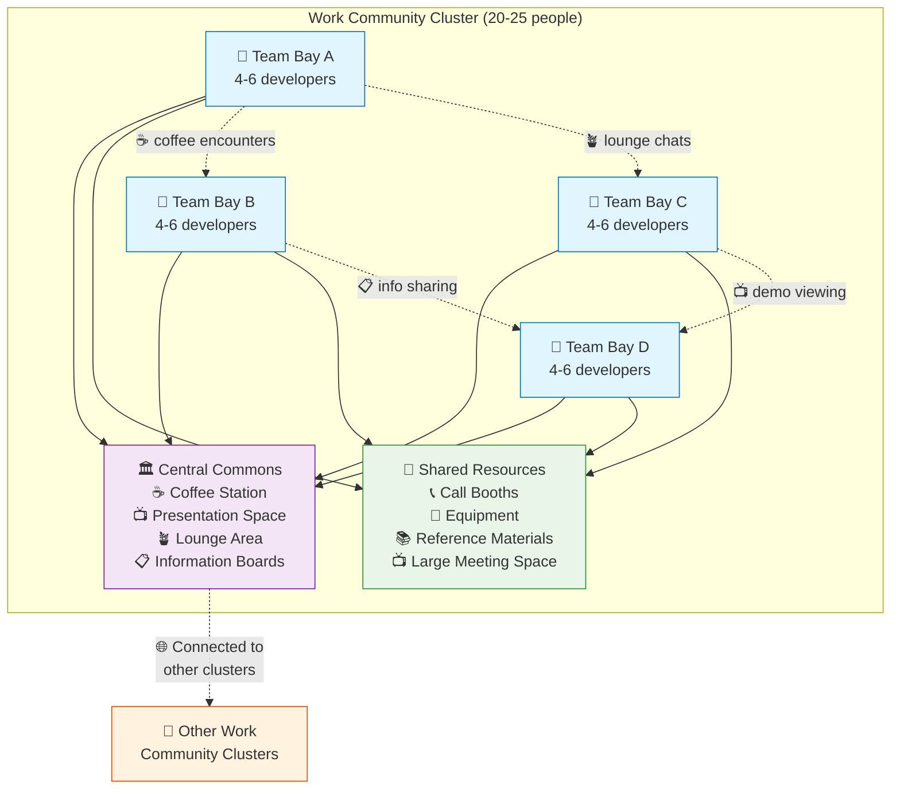

---
---
# Work Community Clusters

## Summary
Design workplaces as small communities of 20–25 workspaces grouped around a shared common area (courtyard or square) with amenities like coffee, presentation space, and greenspace.

## Context
Creating human-scale workplace neighborhoods that foster informal interaction and team identity while maintaining connection to the larger organization.

## Problem
Large open offices or isolated team spaces fail to create the right balance of community and focus. Teams need both identity and connection to other teams.

## Solution
Organize workspaces into clusters that feel like small villages or neighborhoods. Each cluster should:
- Accommodate 20-25 workstations (typically 2-4 teams sharing the space)
- Have a central common area (like a courtyard or square)
- Include shared amenities (coffee station, minimal presentation stage with screen, mobile whiteboard, informal seating)
- Feel semi-autonomous while connected to the larger organization
- Ensure every workstation has access to natural light (Norwegian compliance)

## Visual Layout

### Dimensional Specifications

**Optimal Cluster Dimensions:**
- Total area: 400-600 m² (4,300-6,500 sq ft)
- Team bay: 40-60 m² (430-650 sq ft) for 4-6 people
- Central commons: 100-150 m² (1,075-1,615 sq ft)
- Shared resources: 80-120 m² (860-1,290 sq ft)
- Minimum ceiling height: 2.7m (Norwegian building code)
- Natural light penetration: Maximum 6m from windows

### Work Community Cluster Floor Plan
```
    🌞 NATURAL LIGHT FROM WINDOWS 🌞
    ┌─────────────────────────────────────────────────────────────┐
    │  TEAM       │  TEAM       │  TEAM       │  TEAM       │     │
    │  BAY A      │  BAY B      │  BAY C      │  BAY D      │     │
    │  [4-6 ppl]  │  [4-6 ppl]  │  [4-6 ppl]  │  [4-6 ppl]  │     │
    │             │             │             │             │     │
    │  🖥️🖥️🪑   │  🖥️🖥️🪑   │  🖥️🖥️🪑   │  🖥️🖥️🪑   │     │
    │  🖥️  🪑🖥️  │  🖥️  🪑🖥️  │  🖥️  🪑🖥️  │  🖥️  🪑🖥️  │     │
    │  🪑🖥️🖥️   │  🪑🖥️🖥️   │  🪑🖥️🖥️   │  🪑🖥️🖥️   │ 🚿  │
    │             │             │             │             │UTIL │
    ├─────────────┼─────────────┼─────────────┼─────────────┤     │
    │                                                       │     │
    │              CENTRAL COMMONS AREA                     │     │
    │         (Community Courtyard/Square)                  │     │
    │                                                       │     │
    │  ☕ Coffee    📺 Presentation    🪴 Greenspace        │     │
    │   Station        Space            & Seating          │     │
    │                                                       │     │
    │  📋 Info       ⚬ Mobile          🪑 Lounge          │     │
    │   Boards       Whiteboards       Furniture           │     │
    │                                                       │     │
    ├─────────────┼─────────────┼─────────────┼─────────────┼─────┤
    │  TEAM       │  TEAM       │             │             │     │
    │  BAY E      │  BAY F      │  SHARED     │  SHARED     │     │
    │  [4-6 ppl]  │  [4-6 ppl]  │ RESOURCES   │ MEETING     │     │
    │             │             │             │ SPACE       │     │
    │  🖥️🖥️🪑   │  🖥️🖥️🪑   │ 📞 Call     │             │     │
    │  🖥️  🪑🖥️  │  🖥️  🪑🖥️  │   Booths    │ 📺 Large   │     │
    │  🪑🖥️🖥️   │  🪑🖥️🖥️   │ 🔧 Tools    │   Display   │     │
    │             │             │ 📚 Library  │ 🪑 Flexible │     │
    └─────────────┴─────────────┴─────────────┴─────────────┴─────┘
    🌞 NATURAL LIGHT FROM WINDOWS 🌞
```

### Community Interaction Network


### Alternative Layout Configurations

#### Configuration A: Linear Arrangement (Narrow Building)
```
🌞 WINDOWS ──────────────────────────────────────── WINDOWS 🌞
┌─────┬─────┬─────┬─────┬─────┬─────┬─────┬─────┬─────┬─────┐
│TEAM │TEAM │     │SHARED │    │ CENTRAL COMMONS │     │TEAM │TEAM │
│BAY A│BAY B│     │RESOURCES│   │ ☕📺🪴📋⚬🪑 │     │BAY C│BAY D│
│4-6  │4-6  │     │📞🔧📚  │   │                │     │4-6  │4-6  │
│DEVS │DEVS │     │         │   │                │     │DEVS │DEVS │
└─────┴─────┴─────┴─────────┴───┴────────────────┴─────┴─────┴─────┘
Best for: Narrow buildings, strong team identity, quiet zones
Challenges: Less cross-team interaction, limited expansion
```

#### Configuration B: Courtyard Arrangement (Square Building)
```
                 🌞 WINDOWS 🌞
         ┌─────────────────────────────────┐
         │ TEAM BAY A    │    TEAM BAY B   │
         │   4-6 DEVS    │     4-6 DEVS    │
         │               │                 │
🌞       ├───────────────┼─────────────────┤       🌞
WINDOWS  │               │                 │  WINDOWS
         │  CENTRAL COMMONS COURTYARD      │
         │     ☕📺🪴📋⚬🪑              │
         │               │                 │
         ├───────────────┼─────────────────┤
         │ SHARED RSRC   │    TEAM BAY C   │
         │  📞🔧📚📺    │     4-6 DEVS    │
         │               │                 │
         └─────────────────────────────────┘
Best for: Maximum interaction, natural light optimization
Challenges: Requires corner/courtyard space, noise management
```

#### Configuration C: Hub-and-Spoke (Circular/Hexagonal)
```
                    TEAM BAY A
                     (4-6 DEVS)
                         |
        TEAM BAY F ──── CENTRAL ──── TEAM BAY B
         (4-6 DEVS)     COMMONS      (4-6 DEVS)
                      ☕📺🪴📋         |
        TEAM BAY E ──── ⚬🪑📺 ──── TEAM BAY C
         (4-6 DEVS)               (4-6 DEVS)
                         |
                    TEAM BAY D
                     (4-6 DEVS)
```
Best for: Maximum serendipitous encounters, flexible team sizes
Challenges: Complex HVAC, requires significant floor space

### Implementation Progression Diagrams

#### Phase 1: Minimum Viable Cluster
```
┌─────────────┬─────────────┐
│ TEAM BAY A  │ TEAM BAY B  │ ← Start with 2 teams (8-12 people)
│   4-6 DEVS  │   4-6 DEVS  │
├─────────────┴─────────────┤
│    SHARED COMMONS AREA    │ ← Basic coffee station + whiteboard
│        ☕ 📋 ⚬           │
└───────────────────────────┘
Week 1-4: Basic adjacency, measure interaction patterns
```

#### Phase 2: Enhanced Community
```
┌─────────────┬─────────────┬─────────────┐
│ TEAM BAY A  │ TEAM BAY B  │ TEAM BAY C  │ ← Add 3rd team
│   4-6 DEVS  │   4-6 DEVS  │   4-6 DEVS  │
├─────────────┴─────────────┴─────────────┤
│         ENHANCED COMMONS AREA           │ ← Add presentation space
│        ☕ 📺 📋 ⚬ 🪴 🪑              │   and lounge furniture
├─────────────────────────────────────────┤
│           SHARED RESOURCES              │ ← Add call booths
│             📞 🔧 📚                   │   and tools
└─────────────────────────────────────────┘
Week 5-12: Full amenities, optimize layouts based on usage
```

#### Phase 3: Mature Cluster
```
┌─────────┬─────────┬─────────┬─────────┐
│TEAM A   │TEAM B   │TEAM C   │TEAM D   │ ← Optimal 4 teams
│4-6 DEVS │4-6 DEVS │4-6 DEVS │4-6 DEVS │   (16-24 people)
├─────────┴─────────┴─────────┴─────────┤
│        VIBRANT COMMONS AREA           │ ← Full amenities +
│    ☕ 📺 📋 ⚬ 🪴 🪑 🎯 📊        │   gamification
├───────────────────────────────────────┤
│        COMPREHENSIVE SHARED           │ ← Equipment library
│         📞 🔧 📚 📺 🖨️ 🏃        │   + fitness space
└───────────────────────────────────────┘
Week 13+: Community self-optimization, cross-cluster connections
```

### Common Failure Modes (Anti-Patterns)

#### ❌ The Dead Commons
```
┌─────────┬─────────┬─────────┬─────────┐
│ TEAM A  │ TEAM B  │ TEAM C  │ TEAM D  │
│ ACTIVE  │ ACTIVE  │ ACTIVE  │ ACTIVE  │
├─────────┴─────────┴─────────┴─────────┤
│            EMPTY SPACE                │ ← Unused because:
│               💀                      │   - No amenities
│                                       │   - Bad location
│                                       │   - Wrong size
└───────────────────────────────────────┘
Problem: Commons area not designed for actual use
Fix: Add specific amenities, improve location, measure usage
```

#### ❌ The Noise Hellscape
```
┌─────────┬─────────┬─────────┬─────────┐
│ TEAM A  │ TEAM B  │ TEAM C  │ TEAM D  │
│ 😵‍💫📢  │ 😵‍💫📢  │ 😵‍💫📢  │ 😵‍💫📢  │ ← Can't focus due to
├─────────┴─────────┴─────────┴─────────┤   noise from commons
│          LOUD COMMONS AREA            │
│         📢 💬 📢 💬 📢               │ ← No acoustic treatment
└───────────────────────────────────────┘
Problem: No acoustic separation between focus and social areas
Fix: Add sound dampening, physical barriers, quiet zones
```

#### ❌ The Territorial Isolation
```
┌─────────┬─────────┬─────────┬─────────┐
│ TEAM A  │ TEAM B  │ TEAM C  │ TEAM D  │
│   🚫    │   🚫    │   🚫    │   🚫    │ ← Teams claim territory
├─────────┼─────────┼─────────┼─────────┤   and exclude others
│TEAM A   │TEAM B   │TEAM C   │TEAM D   │
│ONLY ☕  │ONLY 📺  │ONLY 🪑  │ONLY 📋  │ ← Resources become
└─────────┴─────────┴─────────┴─────────┘   team-exclusive
Problem: Teams create silos instead of community
Fix: Shared governance, rotation of responsibilities, clear commons rules
```

### Sight Lines and Privacy Analysis

#### Visual Privacy Zones
```
SIDE VIEW (showing privacy gradients):

🏠 TEAM SPACE     🏛️ COMMONS        🏠 TEAM SPACE
[HIGH PRIVACY] → [MEDIUM PRIVACY] ← [HIGH PRIVACY]
     ||||             |||              ||||
   ██████           ░░░░░░░░           ██████  
   FOCUS            SOCIAL             FOCUS
   WORK             INTERACTION        WORK
   
█ = High visual privacy (concentrated work)
░ = Medium visual privacy (collaborative work)
  = Open visual (social interaction)
```

#### Acoustic Privacy Zones
```
TOP VIEW (showing acoustic treatment):

┌─────────────┬─────────────┐
│ TEAM BAY A  │ TEAM BAY B  │ 🔇 Acoustic panels
│ 🔇 QUIET    │ 🔇 QUIET    │    on shared walls
│ (45-50 dB)  │ (45-50 dB)  │
├─────────────┴─────────────┤ 🎵 Sound masking
│     COMMONS AREA          │    for conversations
│ 🎵 CONVERSATIONAL         │    
│    (55-60 dB)             │ ☕ Coffee machine
└───────────────────────────┘    white noise
```

## Implementation Checklist

### Pre-Implementation (Week -4 to 0)
- [ ] Measure current cross-team interaction frequency (baseline)
- [ ] Survey team preferences for commons amenities and activities
- [ ] Assess space constraints and natural light access
- [ ] Plan acoustic treatment and visual privacy solutions
- [ ] Identify team "commons stewards" for ongoing governance

### Phase 1: Basic Cluster (Week 1-4)
- [ ] Establish 2-3 team adjacency with basic commons area
- [ ] Install essential amenities: coffee station, whiteboard, basic seating
- [ ] Create shared calendar for commons booking/activities
- [ ] Measure: commons usage hours, cross-team conversations per day
- [ ] Weekly retrospective: what's working, what's missing?

### Phase 2: Enhanced Community (Week 5-12)
- [ ] Add presentation capabilities and flexible furniture
- [ ] Implement shared resource library (equipment, books, tools)
- [ ] Establish commons governance (usage norms, cleaning responsibilities)
- [ ] Measure: knowledge sharing incidents, innovation metrics
- [ ] Monthly review: space optimization based on usage patterns

### Phase 3: Mature Ecosystem (Week 13+)
- [ ] Connect to other clusters via shared events/spaces
- [ ] Optimize layout based on 3 months of usage data
- [ ] Implement advanced amenities based on community needs
- [ ] Measure: overall team satisfaction, retention, performance metrics
- [ ] Quarterly evolution: adapt space to changing team needs

## Forces
- **Community vs. Focus**: People need both belonging to a small group and connection to the larger community
- **Formal vs. Informal**: Informal interaction drives innovation, but formal structures prevent chaos
- **Identity vs. Integration**: Teams need identity and focus without isolation from other teams
- **Privacy vs. Transparency**: Balancing visual/acoustic privacy with collaborative transparency
- **Static vs. Adaptive**: Spaces must accommodate changing team sizes and compositions
- **Cultural Sensitivity**: Different cultures have varying preferences for social interaction patterns
- **Compliance**: Norwegian regulations require daylight access for all workstations
- **Accessibility**: Universal design principles must be met throughout all areas
- **Economic**: Balance investment in commons amenities with space efficiency

## Real-World Implementation Examples

### Successful Implementations

**Norwegian Software Company (Oslo)**
- 24-person cluster with 4 teams of 6
- Central commons with Norwegian design aesthetic: natural materials, plants, soft lighting
- Result: 40% increase in cross-team collaboration, 25% reduction in formal meetings
- Key insight: Coffee quality matters more than you think for community building

**Spotify Stockholm Office**
- Multiple clusters of 20-30 people ("tribes")
- Each cluster has dedicated "demo zone" for showcasing work
- Result: Higher innovation metrics, strong tribal identity while maintaining company connection
- Challenge: Scaling beyond 4-5 clusters required additional coordination mechanisms

**Basecamp Chicago Office**
- 16-person cluster with "library rules" for focus time
- Commons area transforms: quiet collaboration during day, social space after hours
- Result: Maintained startup intimacy at 50+ people scale
- Key insight: Time-based usage patterns prevent conflicts between focus and social needs

### Implementation Failures and Lessons

**Tech Startup (Amsterdam) - The Ghost Town**
- Built beautiful 30-person cluster with expensive furniture
- Failed because: No coffee station, commons too formal, no natural gathering reasons
- Recovery: Added coffee, informal seating, demo Fridays to animate the space

**Financial Services Company (Bergen) - The Territory Wars**
- Teams claimed parts of commons as "their" space
- Failed because: No governance model, unequal resource access, cultural hierarchy issues
- Recovery: Implemented rotating "commons steward" role, explicit sharing agreements

### Cultural Adaptation Examples

**German Engineering Firm**
- More structured commons usage: scheduled collaboration times, booked presentation slots
- Adaptation to preference for planned vs. spontaneous interaction
- Result: Same collaboration benefits with more predictable patterns

**Japanese Software Division**
- Smaller commons area, more emphasis on visual information sharing
- Adaptation to cultural preference for indirect communication
- Added extensive visual project displays, reduced emphasis on verbal interaction

**US West Coast Startup**
- Larger, more casual commons with gaming area and flexible seating
- Adaptation to cultural expectation of work-life integration
- Added wellness amenities, outdoor connection, 24/7 access

## Hybrid Work Adaptation and Integration

### Hybrid-First Cluster Design Principles

**Physical-Digital Integration:**
- **Always-On Presence**: Large displays in commons showing remote team member availability and current work
- **Hybrid Meeting Zones**: Dedicated areas optimized for including remote participants in physical conversations
- **Digital Information Radiators**: Screens showing remote team progress, blockers, and achievements
- **Virtual Commons Extension**: Digital spaces that mirror physical commons for remote participation

**Flexible Occupancy Planning:**
- **Variable Capacity Design**: Spaces that function well with 30-100% occupancy
- **Hot-Desking Integration**: Team bays that can accommodate visiting remote workers
- **Anchor Day Optimization**: Commons designed for peak collaboration during designated in-person days
- **Remote Worker Integration**: Seamless inclusion of remote participants in cluster activities

### Technology Infrastructure for Hybrid Clusters

**Audio-Visual Integration:**
- **Omnidirectional Microphones**: Ceiling-mounted arrays capturing natural conversations for remote inclusion
- **360° Cameras**: Fish-eye cameras providing remote workers full visual context of commons activities
- **Multi-Cast Displays**: Screens viewable from multiple angles showing remote participant faces and work
- **Acoustic Design**: Sound masking and echo reduction optimized for video conference quality

**Digital Collaboration Tools:**
- **Shared Digital Whiteboards**: Physical whiteboards with digital overlay for remote real-time collaboration
- **Persistent Video Connections**: Always-on low-bandwidth connections showing remote team member status
- **Digital Pin-Up Spaces**: Online equivalent of physical information displays
- **Collaborative Planning Tools**: Shared calendars and space booking integrated with team workflows

### Hybrid Commons Activities and Rituals

**Daily Interaction Patterns:**
- **Morning Stand-Up Hybrid**: Physical participants in commons, remote workers join via fixed cameras
- **Coffee Connection Calls**: Scheduled informal video calls during coffee break times
- **Demo Friday Extensions**: Physical demos broadcast to remote workers with interactive Q&A
- **Walking Meeting Routes**: Predetermined paths that remote workers can "join" via mobile video

**Weekly Community Building:**
- **Hybrid Learning Sessions**: Presentations delivered simultaneously to physical and remote audiences
- **Cross-Team Show and Tell**: Regular sharing sessions with equal participation for remote/in-person
- **Virtual Coffee Roulette**: Pairing remote and in-person workers for informal conversations
- **Collaborative Problem Solving**: Structured sessions using hybrid-optimized facilitation techniques

**Monthly and Quarterly Events:**
- **All-Hands Hybrid Gatherings**: Large-scale events designed for mixed physical/remote participation
- **Remote Worker Visit Days**: Coordinated visits where remote workers use cluster spaces
- **Digital Commons Evolution**: Regular updates to technology and virtual spaces based on usage patterns
- **Cross-Cluster Virtual Connections**: Video bridges between different physical clusters

### Hybrid Cluster Configurations

#### Configuration H1: Remote-First Cluster
```
┌─────────────────────────────────────────────────────────┐
│ FLEXIBLE TEAM SPACE                                     │
│ (2-8 people depending on day)                          │
│                                                         │
│ 🖥️📱💻  ←→  🌐 REMOTE WORKERS                        │
│ Physical    Always Connected                            │
│ Workers     via Video/Audio                             │
│                                                         │
├─────────────────────────────────────────────────────────┤
│ HYBRID COMMONS AREA                                     │
│                                                         │
│ 📺 Large Display    📹 360° Camera    ☕ Coffee        │
│ (Remote Faces)      (Commons View)     Station          │
│                                                         │
│ 🎤 Omni Mic        📱 Mobile Setup    📋 Digital       │
│ (Pickup All)       (Remote Join)      Boards           │
│                                                         │
│ 🪑 Flexible        📲 QR Codes       🌐 Always-On     │
│ Seating            (Quick Connect)     Remote Feed      │
└─────────────────────────────────────────────────────────┘
Best for: Primarily remote teams with occasional in-person days
Challenge: Maintaining community with low physical occupancy
```

#### Configuration H2: Hybrid-Balanced Cluster
```
┌─────────┬─────────┐         ┌─────────┬─────────┐
│ TEAM A  │ TEAM B  │         │ TEAM C  │ TEAM D  │
│ 50% In  │ 30% In  │         │ 70% In  │ 40% In  │
│ 50% Rem │ 70% Rem │         │ 30% Rem │ 60% Rem │
└─────────┴─────────┘         └─────────┴─────────┘
           │                             │
           └──────────┬─────────────┬────┘
                     │             │
            ┌─────────┴─────────────┴─────────┐
            │    ENHANCED HYBRID COMMONS     │
            │                                │
            │ 📺📺📺 Multi-Display Wall     │
            │ (Shows all remote workers)     │
            │                                │
            │ ☕ Coffee   🎤📹 Recording    │
            │ Station     Booth             │
            │                                │
            │ 🪑 Movable  📱 Device         │
            │ Furniture   Charging          │
            │                                │
            │ 📋 Digital  🌐 Virtual        │
            │ Boards      Reality Space     │
            └────────────────────────────────┘
Best for: Balanced remote/in-person with regular anchor days
Challenge: Managing technology complexity and maintenance
```

#### Configuration H3: Anchor Day Optimization
```
MONDAY-TUESDAY-WEDNESDAY (High Occupancy Days):
┌─────────┬─────────┬─────────┬─────────┐
│ TEAM A  │ TEAM B  │ TEAM C  │ TEAM D  │
│ 90% IN  │ 90% IN  │ 90% IN  │ 90% IN  │
│         │         │         │         │
├─────────┴─────────┴─────────┴─────────┤
│          ACTIVE COMMONS AREA          │
│     ☕📺🪴📋⚬🪑 + EVENTS            │
│    High Energy Social Interaction     │
└───────────────────────────────────────┘

THURSDAY-FRIDAY (Low Occupancy Days):
┌─────────┬─────────┬─────────┬─────────┐
│ TEAM A  │ TEAM B  │ TEAM C  │ TEAM D  │
│ 20% IN  │ 30% IN  │ 25% IN  │ 15% IN  │
│ Focus   │ Deep    │ 1-on-1s │ Admin   │
├─────────┴─────────┴─────────┴─────────┤
│          QUIET COMMONS AREA           │
│       📞📚🔕 + REMOTE WORK           │
│    Individual Focus + Remote Support   │
└───────────────────────────────────────┘
Best for: Organizations with designated anchor days
Challenge: Space utilization efficiency on low-occupancy days
```

### Remote Worker Integration Protocols

**Daily Integration Practices:**
1. **Morning Arrival Ritual**: Physical workers check-in with remote team members via commons display
2. **Visible Availability**: Digital status boards showing remote worker availability and current tasks
3. **Inclusion Checks**: Regular "anyone remote want to join?" invitations for impromptu discussions
4. **End-of-Day Sync**: Brief update session including both physical and remote participants

**Weekly Integration Practices:**
1. **Remote Worker Spotlight**: Weekly feature highlighting remote team member work and achievements
2. **Hybrid Retrospectives**: Review of both physical and digital commons usage and improvements
3. **Technology Health Check**: Weekly testing and maintenance of hybrid collaboration tools
4. **Cross-Timezone Coordination**: Adjustment of commons activities to include global team members

**Monthly Integration Practices:**
1. **Remote Worker Visit Days**: Coordinated periods where remote workers use physical cluster spaces
2. **Digital Commons Evolution**: Updates to virtual spaces based on remote worker feedback
3. **Hybrid Event Planning**: Design of activities that work equally well for remote and physical participants
4. **Culture Assessment**: Regular evaluation of inclusive culture for both remote and in-person workers

### Hybrid Cluster Success Metrics

**Participation Equity Measures:**
- **Speaking Time Balance**: Remote vs. in-person participation ratios in meetings and discussions
- **Decision Influence**: Tracking whether remote workers have equal input in cluster decisions
- **Social Connection**: Friendship and collaboration networks including remote workers
- **Information Access**: Equal access to informal information and company insights

**Technology Effectiveness Measures:**
- **Connection Quality**: Audio/video reliability and user satisfaction scores
- **Usage Analytics**: Frequency and duration of hybrid tool usage
- **Technical Issues**: Number and resolution time of technology-related problems
- **Adoption Rates**: Percentage of activities successfully adapted to hybrid format

**Community Health Measures:**
- **Inclusion Surveys**: Regular assessment of belonging and inclusion for remote workers
- **Cultural Indicators**: Shared jokes, references, and inside knowledge across remote/in-person
- **Conflict Resolution**: Successful handling of hybrid work tensions and miscommunications
- **Long-term Retention**: Retention rates comparison between remote and in-person cluster members

### Hybrid Failure Modes and Recovery

#### ❌ The Remote Second-Class Effect
```
Physical Commons: 🏢 Rich interaction, full access to information
                 ↕️ 
Digital Commons:  💻 Limited interaction, delayed information
```
**Problem**: Remote workers become second-class citizens in cluster community
**Recovery**: 
- Implement "remote-first" meeting practices even in physical spaces
- Assign dedicated inclusion advocates for remote worker representation
- Create digital-first information sharing that benefits everyone
- Regular remote worker feedback sessions and rapid response to concerns

#### ❌ The Technology Overload Disaster
```
Physical Workers: 😵‍💫 Overwhelmed by screens, cameras, microphones
Digital Workers:  😵‍💫 Frustrated by poor audio, frozen video, technical issues
```
**Problem**: Too much technology creates barriers instead of bridges
**Recovery**:
- Simplify technology to essential tools only
- Invest in professional-grade, reliable equipment
- Train all users on technology best practices
- Provide dedicated technical support for hybrid clusters

#### ❌ The Timezone Tyranny
```
8 AM PST  |  11 AM EST  |  4 PM GMT  |  1 AM JST
   😊     |     😊      |     😐     |     😴
  Good    |    Good     |   Tired    | Sleeping
```
**Problem**: Synchronous activities exclude workers in unfavorable timezones
**Recovery**:
- Rotate meeting times to share timezone burden
- Create asynchronous equivalents for all synchronous activities
- Record important sessions for later viewing
- Establish regional cluster representatives for global coordination

### Measuring Hybrid Success

**Quantitative Hybrid Metrics:**
- **Participation Parity**: ±10% variance between remote and in-person participation rates
- **Information Equity**: Remote workers learn about informal decisions within 24 hours
- **Technology Reliability**: >95% uptime for hybrid collaboration tools
- **Cross-Location Collaboration**: 25%+ of project work involves both remote and in-person workers

**Qualitative Hybrid Indicators:**
- Remote workers feel equally included in cluster culture and decision-making
- In-person workers naturally include remote colleagues in informal conversations
- Technology feels transparent rather than intrusive
- Cluster identity transcends physical/remote boundaries
- New hybrid interaction patterns emerge organically

## Related Patterns

### Essential Spatial Combinations
- [Small Team Bays](small-team-bays.md) - The individual team spaces within each cluster
- [Half-Open, Half-Private Spaces](half-open-half-private-spaces.md) - Balancing privacy within the cluster
- [Environmental Comfort Patterns](environmental-comfort-patterns.md) - Ensuring basic comfort in shared spaces

### Community and Interaction Patterns
- [Neighborhood Effect and Serendipity](neighborhood-effect-serendipity.md) - Maximizing beneficial chance encounters
- [Adjacent Semi-Private Spaces](adjacent-semi-private-spaces.md) - Transition zones within clusters
- [Pin-Up Space](../cross-disciplinary/pin-up-space.md) - Dedicated areas for sharing work

### Organizational Support Patterns
- [Self-Governing Teams](../organizational/self-governing-teams.md) - Team autonomy within community structure
- [Cross-Team Synchronization](../organizational/cross-team-synchronization.md) - Coordination between cluster teams
- [Embedded Coordination Roles](../organizational/embedded-coordination-roles.md) - Commons stewardship

### Meta-Pattern Alignment
- [Transparency and Osmotic Communication](../meta-patterns/transparency-osmotic-communication.md) - Information flow facilitation
- [Spaces that Empower and Invite](../meta-patterns/spaces-empower-invite.md) - Creating welcoming community areas
- [Human-Centric Design](../meta-patterns/human-centric-design.md) - Designing for human psychology and behavior

## Measurement and Success Metrics

### Quantitative Metrics
- **Space Utilization**: Commons area occupied 40-70% of work hours (optimal range)
- **Cross-Team Interaction**: 3-5 meaningful conversations per person per day across team boundaries
- **Knowledge Transfer**: 15-25% reduction in duplicate work or "reinventing the wheel" incidents
- **Meeting Efficiency**: 20-30% reduction in formal cross-team coordination meetings
- **Team Satisfaction**: 8+ out of 10 on "I have access to people and information I need"

### Qualitative Indicators
- Teams spontaneously use commons for impromptu collaboration
- Cross-team friendships and informal relationships develop
- Commons area feels "alive" rather than empty or forced
- Teams take ownership of commons maintenance and improvement
- New team members integrate quickly through commons interactions

### Warning Signs (Course Correction Needed)
- Commons consistently empty or used by only one team
- Complaints about noise, privacy, or territorial conflicts
- Teams actively avoiding commons area
- No cross-team collaboration despite physical proximity
- Commons becomes storage area or dumping ground

## Sources and Further Reading

### Foundational Research
- Christopher Alexander, "A Pattern Language" (Pattern 41: Work Community)
- Thomas Allen, "Managing the Flow of Technology" - proximity and communication research
- Stewart Brand, "How Buildings Learn" - adaptive space design principles

### Regulatory and Compliance
- Norwegian Building Code (TEK17) - daylight and accessibility requirements
- Universal Design principles for workplace environments
- EU Workplace Safety Directives

### Contemporary Studies
- MIT Media Lab spatial innovation research
- Google's "Project Aristotle" team effectiveness findings
- Steelcase Global Report on workplace engagement
- Harvard Business Review workplace collaboration studies

### Implementation Guides
- "Workplace Strategy" by Francis Duffy
- "The Social Life of Small Urban Spaces" by William H. Whyte
- BREEAM and LEED workplace design guidelines