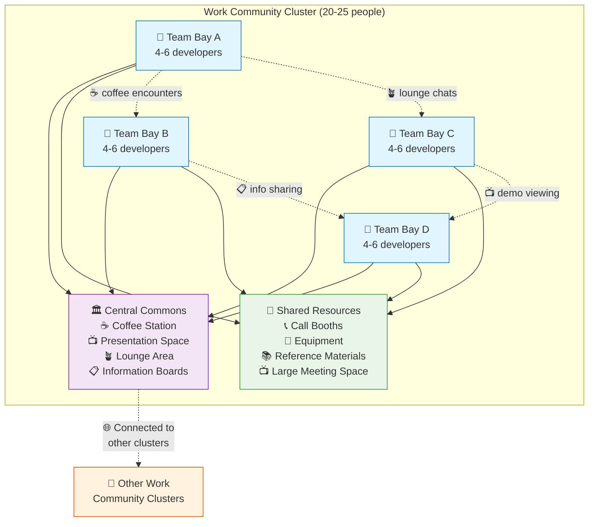

# Work Community Clusters

## Summary
Design workplaces as small communities of 20–25 workspaces grouped around a shared common area (courtyard or square) with amenities like coffee, presentation space, and greenspace.

## Context
Creating human-scale workplace neighborhoods that foster informal interaction and team identity while maintaining connection to the larger organization.

## Problem
Large open offices or isolated team spaces fail to create the right balance of community and focus. Teams need both identity and connection to other teams.

## Solution
Organize workspaces into clusters that feel like small villages or neighborhoods. Each cluster should:
- Accommodate 20-25 workstations (typically 2-4 teams sharing the space)
- Have a central common area (like a courtyard or square)
- Include shared amenities (coffee station, minimal presentation stage with screen, mobile whiteboard, informal seating)
- Feel semi-autonomous while connected to the larger organization
- Ensure every workstation has access to natural light (Norwegian compliance)

## Visual Layout

### Work Community Cluster Floor Plan
```
    🌞 NATURAL LIGHT FROM WINDOWS 🌞
    ┌─────────────────────────────────────────────────────────────┐
    │  TEAM       │  TEAM       │  TEAM       │  TEAM       │     │
    │  BAY A      │  BAY B      │  BAY C      │  BAY D      │     │
    │  [4-6 ppl]  │  [4-6 ppl]  │  [4-6 ppl]  │  [4-6 ppl]  │     │
    │             │             │             │             │     │
    │  🖥️🖥️🪑   │  🖥️🖥️🪑   │  🖥️🖥️🪑   │  🖥️🖥️🪑   │     │
    │  🖥️  🪑🖥️  │  🖥️  🪑🖥️  │  🖥️  🪑🖥️  │  🖥️  🪑🖥️  │     │
    │  🪑🖥️🖥️   │  🪑🖥️🖥️   │  🪑🖥️🖥️   │  🪑🖥️🖥️   │ 🚿  │
    │             │             │             │             │UTIL │
    ├─────────────┼─────────────┼─────────────┼─────────────┤     │
    │                                                       │     │
    │              CENTRAL COMMONS AREA                     │     │
    │         (Community Courtyard/Square)                  │     │
    │                                                       │     │
    │  ☕ Coffee    📺 Presentation    🪴 Greenspace        │     │
    │   Station        Space            & Seating          │     │
    │                                                       │     │
    │  📋 Info       ⚬ Mobile          🪑 Lounge          │     │
    │   Boards       Whiteboards       Furniture           │     │
    │                                                       │     │
    ├─────────────┼─────────────┼─────────────┼─────────────┼─────┤
    │  TEAM       │  TEAM       │             │             │     │
    │  BAY E      │  BAY F      │  SHARED     │  SHARED     │     │
    │  [4-6 ppl]  │  [4-6 ppl]  │ RESOURCES   │ MEETING     │     │
    │             │             │             │ SPACE       │     │
    │  🖥️🖥️🪑   │  🖥️🖥️🪑   │ 📞 Call     │             │     │
    │  🖥️  🪑🖥️  │  🖥️  🪑🖥️  │   Booths    │ 📺 Large   │     │
    │  🪑🖥️🖥️   │  🪑🖥️🖥️   │ 🔧 Tools    │   Display   │     │
    │             │             │ 📚 Library  │ 🪑 Flexible │     │
    └─────────────┴─────────────┴─────────────┴─────────────┴─────┘
    🌞 NATURAL LIGHT FROM WINDOWS 🌞
```

### Community Interaction Network


## Forces
- People need both belonging to a small group and connection to the larger community
- Informal interaction drives innovation and knowledge sharing
- Teams need identity and focus without isolation
- Norwegian regulations require daylight access for all workstations
- Accessibility requirements must be met throughout

## Examples
- Alexander's "Work Community" (Pattern 41) treating workplace like a neighborhood
- Corporate campuses with team clusters around atriums
- Basecamp's quiet "library rules" with social kitchen areas

## Related Patterns
- [Small Team Bays](small-team-bays.md)
- [Neighborhood Effect and Serendipity](neighborhood-effect-serendipity.md)
- [Self-Governing Teams](../organizational/self-governing-teams.md)

## Sources
- Christopher Alexander, "A Pattern Language" (Pattern 41)
- Norwegian Workplace Regulations (daylight requirements)
- Research on innovation and informal interaction