---
---
# U-Shape Team Layout

## Summary
Arrange team workstations in U-shaped configurations with people sitting inside the U facing outward. This enables easy mobility and collaboration while maintaining individual focus.

## Context
Teams need seating arrangements that enable effective communication. They also need to ensure all team members can participate equally in discussions and collaborative work.

## Problem
Linear seating arrangements can create communication barriers and exclude some team members from discussions. Scattered seating makes group coordination difficult.

## Solution
Arrange team workstations in U-shaped configurations with people sitting inside the U facing outward toward their screens. Use wheeled chairs for easy collaboration.

**Software Team Implementation:**
- **Perimeter workstations**: Individual desks positioned around room perimeter facing walls, allowing easy swivel to face team center
- **Central collaboration space**: Open area or shared table at the center of the U-shape for team gatherings
- **Pair programming pods**: Adjacent workstations within the U-shape that can function as pairing stations
- **Mobile collaboration**: Office chairs with wheels allow easy scooting between workstations for pair programming
- **Monitor visibility**: Screens for easily showing others, with easy chair mobility for collaboration

**Communication Optimization:**
- **Easy mobility**: Team members can quickly wheel their chairs to collaborate at any workstation
- **Peripheral awareness**: While facing outward, team members maintain awareness of teammates in their peripheral vision
- **Quick pivoting**: Simple chair turn allows instant face-to-face communication when needed
- **Central meeting point**: Open center of U contains gathering space for stand-ups and team discussions

**Flexible Configuration:**
- **Modular implementation**: Wide desks at right angles forming corners of the U-shape
- **Breakaway options**: Adjacent quiet spaces or privacy screens for concentrated individual work
- - **Scalable design**: U-shape can accommodate 4-6 team members comfortably, perhaps doubling if needed for shorter paring sessions on wide desk-workstations
- **Activity zones**: Different areas of the U can support different collaborations, e.g with a wall-mounted screen at the bottom of the U for software teaming sessions
- **Accessibility accommodations**: Ensure adequate space and access for wheelchairs and mobility aids
- **Acoustic management**: Balance collaborative communication with individual focus needs

## Visual Layout

### Basic U-Shape Configuration
```
                 ┌─────────────────────────────────┐
                 │         WALL/DISPLAYS            │
                 └─────────────────────────────────┘
                                 
┌─────────────────┐                   ┌─────────────────┐
│      DESK       │                   │      DESK       │
│        A        │                   │        B        │
│  🪑 (facing     │                   │   (facing 🪑   │
│     outward)    │                   │    outward)     │
└─────────────────┘                   └─────────────────┘
        |                                       |
        |          ┌─────────────────┐         |
        |          │   COLLABORATION │         |
        |          │      SPACE      │         |
        |          │  ○ Table/Stand  │         |
        |          │  📺 Screen      │         |
        |          │  ⚬ Mobile      │         |
        |          │    Chairs       │         |
        |          └─────────────────┘         |
        |                                       |
┌─────────────────┐                   ┌─────────────────┐
│      DESK       │                   │      DESK       │
│        F        │                   │        C        │
│  🪑 (facing     │                   │   (facing 🪑   │
│     outward)    │                   │    outward)     │
└─────────────────┘                   └─────────────────┘
        |                                       |
        └───────────────────────────────────────┘
                         |
                ┌─────────────────┐
                │      DESK       │
                │        E        │
                │   🪑 (facing    │
                │     outward)    │
                └─────────────────┘
                         |
                ┌─────────────────┐
                │      DESK       │
                │        D        │
                │   🪑 (facing    │
                │     outward)    │
                └─────────────────┘
```

### Collaboration Flow Diagram

```mermaid
graph TD
    subgraph "U-Shape Team Layout"
        PERSON_A[👤 Developer A<br/>🖥️ Individual Work] 
        PERSON_B[👤 Developer B<br/>🖥️ Individual Work]
        PERSON_C[👤 Developer C<br/>🖥️ Individual Work]
        PERSON_D[👤 Developer D<br/>🖥️ Individual Work]
        CENTER[🏛️ Center Space<br/>○ Stand-up Table<br/>📺 Shared Display<br/>⚬ Mobile Chairs]
    end
    
    %% Easy mobility connections
    PERSON_A -.->|🪑 wheel over| PERSON_B
    PERSON_B -.->|🪑 wheel over| PERSON_C  
    PERSON_C -.->|🪑 wheel over| PERSON_D
    PERSON_D -.->|🪑 wheel over| PERSON_A
    
    %% Central collaboration
    PERSON_A --> CENTER
    PERSON_B --> CENTER
    PERSON_C --> CENTER  
    PERSON_D --> CENTER
    
    %% Peripheral awareness
    PERSON_A -.->|👁️ peripheral<br/>awareness| PERSON_B
    PERSON_B -.->|👁️ peripheral<br/>awareness| PERSON_C
    PERSON_C -.->|👁️ peripheral<br/>awareness| PERSON_D
    PERSON_D -.->|👁️ peripheral<br/>awareness| PERSON_A
    
    classDef person fill:#e1f5fe,stroke:#0277bd
    classDef center fill:#f3e5f5,stroke:#7b1fa2
    classDef mobility stroke-dasharray: 5 5
    
    class PERSON_A,PERSON_B,PERSON_C,PERSON_D person
    class CENTER center
```


## Accessibility Considerations for Inclusive U-Shape Layouts

*Ensure U-shape configurations accommodate team members with mobility challenges and diverse accessibility needs.*

**Wheelchair and Mobility Aid Access:**
- **Minimum clearances**: 60" (1.5m) turning radius at the center of the U for wheelchair maneuvering
- **Adjustable desk heights**: Sit-stand desks or height-adjustable workstations to accommodate different users
- **Accessible pathway width**: Minimum 44" (1.1m) clear width between workstations for navigation
- **Corner configuration**: Rounded or angled corners instead of sharp 90-degree angles for easier navigation
- **Emergency egress**: Ensure at least two clear exit paths from the U-shape configuration

**Alternative Communication Methods:**
- **Visual communication aids**: Overhead displays or wall-mounted screens visible from all positions
- **Hearing accessibility**: Minimize acoustic barriers between positions, consider hearing loop systems
- **Sign language accommodation**: Clear sight lines between all team members for visual communication
- **Assistive technology space**: Additional surface area for screen readers, alternative keyboards, or communication devices

**Flexible Accommodation:**
- **Modular positioning**: Ability to temporarily reconfigure the U-shape for specific accessibility needs
- **Alternative seating**: Space for standing desks or alternative seating options within the U configuration
- **Personal space adjustments**: Ability to modify individual workspace size while maintaining team connectivity

## Acoustic Considerations for Communication Balance

*Address noise and sound transmission challenges inherent in U-shape collaborative layouts.*

**Sound Management Strategies:**
- **Acoustic zoning**: Use different ceiling heights or acoustic treatments to create sound zones within the U
- **Material selection**: Specify sound-absorbing desk surfaces, acoustic panels on walls facing the center
- **Speech privacy**: Background masking at 42-45 dB to reduce speech intelligibility between workstations
- **Reverberation control**: Target RT60 of 0.4-0.6 seconds for optimal speech clarity in the center collaboration area

**Communication Protocol Design:**
- **Volume etiquette**: Establish norms for conversation volume levels at different times (focus vs. collaboration periods)
- **Signal systems**: Visual or subtle audio signals for transitioning between individual focus and team collaboration modes
- **Phone call management**: Designate specific positions or times for phone calls to minimize disruption
- **Noise monitoring**: Use sound level apps to maintain awareness of ambient noise levels

**Physical Sound Barriers:**
- **Partial screens**: Low-height acoustic panels (36-42") that provide sound reduction without visual isolation
- **Workstation orientation**: Angle monitors slightly inward to create natural sound barriers
- **Soft materials**: Include plants, fabric panels, or acoustic ceiling treatments to absorb excess sound
- **Technology solutions**: Noise-canceling headphones available for intense focus periods

## Hybrid Adaptation for Remote Team Members

*Modify U-shape layouts to effectively include remote team members in collaborative activities.*

**Technology Integration for Hybrid Participation:**
- **Central display system**: Large wall-mounted display at the bottom of the U showing remote team members' faces
- **360-degree cameras**: Ceiling-mounted or central table cameras providing full visibility of the U-shape to remote participants
- **Distributed microphones**: Multiple directional microphones ensuring remote participants can hear all in-person team members
- **Individual cameras**: Optional personal cameras at each workstation for paired programming or detailed technical discussions

**Hybrid Collaboration Protocols:**
- **Presence awareness**: Visual indicators showing which remote team members are available for spontaneous collaboration
- **Inclusion practices**: Explicit protocols ensuring remote team members are included in peripheral conversations
- **Digital whiteboarding**: Central display connected to shared digital whiteboard tools accessible to both in-person and remote team members
- **Hybrid stand-ups**: Central gathering space designed for both in-person team members and remote participants

**Space Configuration Adaptations:**
- **Camera positioning**: Ensure the central collaboration area is visible to cameras without creating privacy concerns for individual workstations
- **Lighting design**: Balanced lighting that works well for video conferencing without creating glare on monitors
- **Acoustic optimization**: Enhanced sound systems that clearly transmit team discussions to remote participants
- **Digital information displays**: Shared screens showing team dashboards, sprint boards, or other information visible to both in-person and remote team members

**Maintaining Team Cohesion:**
- **Rotation protocols**: Regular rotation of which team members work in-person vs. remotely to maintain relationship balance
- **Hybrid pair programming**: Dedicated setups within the U-shape optimized for pairing between in-person and remote developers
- **Social connection**: Informal interaction opportunities that include remote team members (virtual coffee breaks, team lunches via video)
- **Equal participation**: Design collaboration activities that give equal voice to in-person and remote team members  

## Forces
- Equal participation vs. space efficiency
- Flexibility vs. optimal communication layout
- Individual workspace vs. team configuration
- Acoustic considerations vs. visual communication

## Examples
- **Software Development Teams:** Teams using U-shaped desk arrangements report improved screen visibility and effortless communication

## Related Patterns
- [Small Team Bays](../architectural-spatial/small-team-bays.md) - Provides space framework for U-shaped arrangements
- [Pair Programming Workstations](../architectural-spatial/pair-programming-workstations.md) - Individual stations within the U-shape
- [Mob Programming Corner](../architectural-spatial/mob-programming-corner.md) - Central collaboration area at the bottom of the U
- [Modular Furniture and Reconfigurability](modular-furniture-reconfigurability.md) - Enables adjustable U-shape implementation
- [Half-Open, Half-Private Spaces](../architectural-spatial/half-open-half-private-spaces.md) - Balances openness with focus needs

## Sources
- Manufacturing cell design principles
- Team communication research
- Collaborative workspace design studies