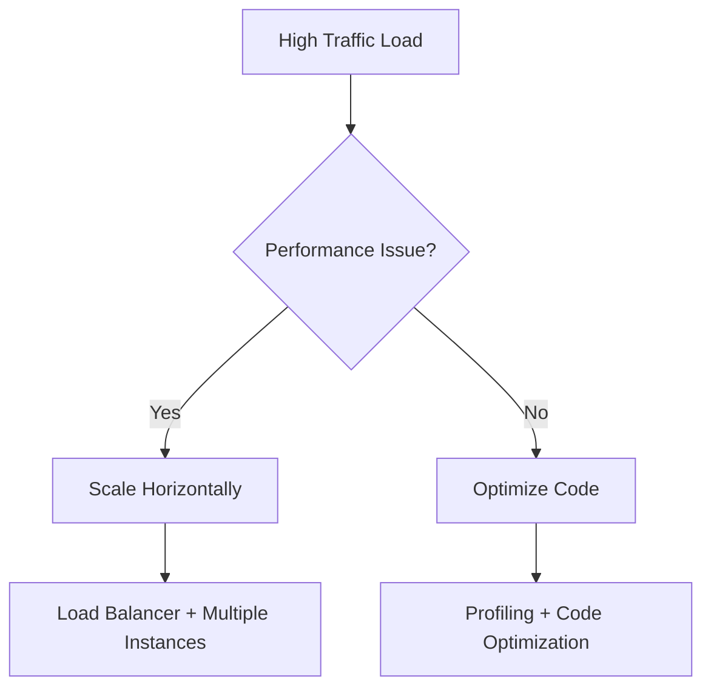

---
---
# Architecture Decision Records (ADR)

## Summary
Document key architectural decisions with context, rationale, and consequences to maintain clarity, alignment, and institutional memory across the team.

## Context
Software teams make numerous architectural decisions that affect system design, team coordination, and long-term maintenance. These decisions often involve important trade-offs and require explanation to stakeholders.

## Problem
Important architectural decisions go undocumented, half-remembered, or miscommunicated, leading to confusion, repeated discussions, and loss of context over time. Teams struggle to understand why certain approaches were chosen and whether they're still valid.

## Solution
Create Architecture Decision Records (ADRs) for decisions with significant consequences, trade-offs, or that require people to change their behavior. Use a collaborative process involving open discussion within the team and with stakeholders.

## Forces
- Memory vs. Overhead - Documentation takes time but prevents context loss
- Shared Understanding vs. Individual Knowledge - Decisions need to be accessible to all team members
- Current Relevance vs. Historical Context - Must capture reasoning while decisions are fresh
- Transparency vs. Efficiency - Open ADR process improves quality but requires coordination

## Implementation
1. **Sense the Need**: Identify decisions that have significant consequences or require behavior changes
2. **Create ADR Document**: Use consistent template with Title, Status, Context, Decision, Consequences
3. **Research and Gather Input**: Ask around for input, capture relevant context and constraints
4. **Propose Decision**: Think through consequences and document both positive and negative impacts
5. **Decide with Participants**: Involve necessary stakeholders in the decision process
6. **Communicate Decision**: Share the ADR with affected teams and store it with the code
7. **Maintain Under Version Control**: Keep ADRs discoverable and up-to-date

## ADR Template Variations

### Standard ADR Template (General Decisions)
```
# ADR-XXXX: [Title in imperative form, <50 characters]

Status: [In Progress/Proposed/Accepted/Overridden/Obsolete]
Accepted by: [Names of decision makers]
Date: [Decision date]
Supersedes: [ADR-YYYY if replacing previous decision]

## Context
[Value-neutral factual description of the challenge. What forces 
(technical, political, social) influence the decision? What is 
the current situation?]

## Decision
[What change(s) are we making in response to the challenge?]

## Consequences
[What becomes easier or more difficult after this decision? 
Include both positive and negative consequences.]
```

### Technical Infrastructure ADR Template
```
# ADR-XXXX: [Infrastructure Decision Title]

Status: [In Progress/Proposed/Accepted/Overridden/Obsolete]
Accepted by: [Names of decision makers]
Date: [Decision date]
Review Date: [When to revisit this decision]

## Problem Statement
[What technical problem are we solving?]

## Decision Drivers
- [Key factor 1, e.g., Performance requirements]
- [Key factor 2, e.g., Cost constraints]
- [Key factor 3, e.g., Team expertise]

## Considered Options
1. **Option A**: [Brief description]
   - Pros: [Advantages]
   - Cons: [Disadvantages]
   - Cost: [Estimated cost/effort]

2. **Option B**: [Brief description]
   - Pros: [Advantages]
   - Cons: [Disadvantages]
   - Cost: [Estimated cost/effort]

## Decision
[Chosen option and rationale]

## Implementation Plan
- [ ] Step 1: [Specific action]
- [ ] Step 2: [Specific action]
- [ ] Step 3: [Specific action]

## Acceptance Criteria
- [Measurable success criterion 1]
- [Measurable success criterion 2]

## Risks and Mitigation
- **Risk**: [Potential issue]
  - **Likelihood**: [High/Medium/Low]
  - **Impact**: [High/Medium/Low]
  - **Mitigation**: [How we'll address it]
```

### Process/Team ADR Template
```
# ADR-XXXX: [Process Decision Title]

Status: [In Progress/Proposed/Accepted/Overridden/Obsolete]
Accepted by: [Names of decision makers]
Date: [Decision date]
Trial Period: [If experimental, when to evaluate]

## Current State
[How do we currently handle this process/situation?]

## Desired Outcome
[What do we want to achieve?]

## Decision
[What process/approach are we adopting?]

## Implementation
- **When**: [Timeline for rollout]
- **Who**: [Responsible parties]
- **How**: [Specific steps]
- **Training**: [What support is needed]

## Success Metrics
- [How we'll measure if this is working]
- [Specific metrics and targets]

## Rollback Plan
[If this doesn't work, how do we revert?]
```

### Security ADR Template
```
# ADR-XXXX: [Security Decision Title]

Status: [In Progress/Proposed/Accepted/Overridden/Obsolete]
Accepted by: [Names of decision makers + Security Review]
Date: [Decision date]
Compliance: [Relevant standards/regulations]

## Threat Model
[What threats are we addressing?]

## Security Requirements
- [Requirement 1]
- [Requirement 2]
- [Requirement 3]

## Decision
[Security approach/solution chosen]

## Risk Assessment
- **Residual Risks**: [Risks that remain after implementation]
- **Risk Level**: [High/Medium/Low]
- **Acceptance**: [Who accepts the residual risk]

## Implementation
- [ ] Security control 1
- [ ] Security control 2
- [ ] Testing and validation
- [ ] Documentation update

## Monitoring
[How we'll detect if security posture changes]
```

## Visualization Techniques

### Decision Flow Diagrams
Include Mermaid diagrams to show decision logic:


### Option Comparison Tables
```markdown
| Criteria | Option A (REST) | Option B (GraphQL) | Weight |
|----------|----------------|-------------------|---------|
| Team Expertise | ✅ High | ❌ Low | 3 |
| Performance | ✅ Good | ⚠️ Variable | 2 |
| Client Flexibility | ❌ Limited | ✅ High | 2 |
| **Total Score** | **9** | **6** | |
```

### Timeline and Impact Diagrams
```markdown
## Implementation Timeline
```
Week 1-2: API design
Week 3-4: Core implementation  
Week 5-6: Testing and docs
Week 7-8: Migration and rollout
```

## Impact Map
- **Frontend Team**: Must update API calls → 2 weeks effort
- **Mobile Team**: New SDK needed → 3 weeks effort  
- **QA Team**: New test scenarios → 1 week effort
```

### Architecture Diagrams
Embed relevant system diagrams showing before/after states:
```
## Before: Monolithic Database
[App] → [Database]

## After: Microservices Pattern  
[App] → [Service A] → [DB A]
     → [Service B] → [DB B]
```

## Discovery Mechanisms

### ADR Index Generation
Maintain an auto-generated index of all ADRs:
```bash
# Generate ADR index script
#!/bin/bash
echo "# Architecture Decision Records" > ADR-INDEX.md
echo "" >> ADR-INDEX.md
echo "## By Status" >> ADR-INDEX.md
for status in "Proposed" "Accepted" "Overridden" "Obsolete"; do
    echo "### $status" >> ADR-INDEX.md
    grep -l "Status: $status" ADR-*.md | sort | while read file; do
        title=$(grep "^# " "$file" | cut -d' ' -f2-)
        echo "- [$title]($file)" >> ADR-INDEX.md
    done
done
```

### Tagging System
Add tags to make ADRs searchable:
```yaml
---
title: "Adopt REST API Architecture"
tags: [api, backend, integration, rest]
components: [user-service, auth-service]
stakeholders: [frontend-team, mobile-team]
impact: high
effort: medium
---
```

### ADR Search Tools
**GitHub/GitLab Search Techniques**:
- Use consistent tags: `label:adr`, `type:infrastructure`
- Standard prefixes: `ADR-001:`, `DECISION:`
- Directory structure: `/docs/adr/`, `/decisions/`

**Command Line Discovery**:
```bash
# Find all ADRs by topic
grep -r "database" docs/adr/

# Find recent decisions
find docs/adr/ -name "*.md" -newer $(date -d '30 days ago' +%Y-%m-%d)

# List by status
grep -l "Status: Accepted" docs/adr/*.md
```

### Integration with Development Tools
**IDE Integration**:
- VS Code extension for ADR templates
- IntelliJ live templates for quick ADR creation
- Vim snippets for common sections

**Git Hooks**:
```bash
# Pre-commit hook to validate ADR format
#!/bin/bash
for file in $(git diff --cached --name-only | grep "docs/adr/.*\.md$"); do
    if ! grep -q "^## Decision$" "$file"; then
        echo "ADR $file missing required Decision section"
        exit 1
    fi
done
```

**Pull Request Integration**:
- Require ADR for architectural changes
- Link PRs to relevant ADRs in description
- Auto-comment with ADR templates for large changes

### Notification and Review Systems
**ADR Review Process**:
- Weekly ADR review in architecture meetings
- Slack/Teams notifications for new ADRs
- Email digest of pending decisions

**Automated Reminders**:
```yaml
# GitHub Action for ADR reviews
name: ADR Review Reminder
on:
  schedule:
    - cron: '0 9 * * MON'  # Every Monday at 9 AM
jobs:
  remind:
    runs-on: ubuntu-latest
    steps:
      - name: Find pending ADRs
        run: |
          grep -l "Status: Proposed" docs/adr/*.md | \
          xargs -I {} echo "Review needed: {}"
```

## Examples
**API Architecture Decision (with visualization):**
- Context: Need to choose between GraphQL flexibility vs REST simplicity
- Decision: Adopt REST with Consumer Driven Contracts
- Visualization: Included comparison table and API flow diagram
- Consequences: Leverages team expertise but requires CDC infrastructure

**Database Migration (with timeline):**
- Context: Current database cannot handle projected scale
- Decision: Gradual migration using dual-write pattern over 6 months
- Visualization: Migration timeline and data flow diagrams
- Consequences: Maintains availability but increases complexity during transition

## Related Patterns
- [One-Way vs Two-Way Door Decisions](one-way-two-way-door-decisions.md) - ADRs particularly important for one-way door decisions
- [Structured Experiments](structured-experiments.md) - Document experiment results that lead to decisions
- [Transparent Artifacts](transparent-artifacts.md) - ADRs are key form of transparent decision documentation
- [I Intend To](i-intend-to.md) - Stating intent to create ADR before making decision

## Sources
- "Documenting Architecture Decisions" by Michael Nygard
- ADR GitHub organization and tooling
- Markdown Architecture Decision Records (MADR) format