---
tags:
  - pattern
  - organizational
  - team-structure-autonomy
---
# Decision-Making Patterns

## Summary
Use advice process and consent-based governance to enable distributed decision-making while maintaining quality and stakeholder input, supported by frameworks that match decision processes to context and complexity.

## Context
Software teams need to make many decisions quickly, but important decisions require input from stakeholders and domain experts to ensure quality outcomes. Different types of decisions require different approaches based on their complexity, reversibility, and impact.

## Problem
Centralized decision-making creates bottlenecks and slows down teams, while completely distributed decisions can lead to poor quality choices and lack of stakeholder buy-in. Teams often apply the same decision process to all situations, either over-processing simple decisions or under-analyzing complex ones.

## Solution
Implement a multi-layered approach to decision-making:

1. **Advice Process**: Decision-makers must seek input from affected parties and domain experts before making decisions
2. **Consent-Based Governance**: Use consent rather than consensus for team-level decisions
3. **Context-Sensitive Frameworks**: Match decision processes to the type and complexity of the decision
4. **Transparent Documentation**: Record important decisions with rationale and consequences

## Forces
- Speed of decision-making vs. quality of decisions
- Individual accountability vs. collective wisdom
- Stakeholder involvement vs. decision-making efficiency
- Domain expertise vs. local knowledge
- Complexity vs. simplicity in decision processes
- Reversibility vs. permanence of choices

## Related Patterns
- [One-Way vs Two-Way Door Decisions](one-way-two-way-door-decisions.md) - Assess decision reversibility
- [Cynefin-Based Decision Framework](cynefin-based-decision-framework.md) - Match process to complexity
- [Structured Experiments](structured-experiments.md) - Reduce uncertainty before deciding
- [Nominal Group Technique](nominal-group-technique.md) - Gather diverse input without bias
- [Ranked Voting](ranked-voting.md) - Aggregate preferences fairly
- [Architecture Decision Records](architecture-decision-records.md) - Document decision rationale
- [Thinking Out Loud](thinking-out-loud.md) - Share reasoning process
- [I Intend To](i-intend-to.md) - Communicate planned actions
- [Aligned Autonomy](aligned-autonomy.md) - Balance freedom with alignment
- [Self-Governing Teams](self-governing-teams.md) - Team-level decision authority
- [Transparent Artifacts](transparent-artifacts.md) - Make decisions visible

## Further details

### Decision Framework Selection

**Decision Type Flowchart:**

```mermaid
graph TD
    START[New Decision Required] --> ASSESS{Assess Decision}
    
    ASSESS --> REVERSIBILITY{Is this decision<br/>easily reversible?}
    ASSESS --> IMPACT{What's the<br/>impact scope?}
    ASSESS --> COMPLEXITY{How complex<br/>is the domain?}
    
    REVERSIBILITY -->|Yes| TWO_WAY[Two-Way Door Decision<br/>⚡ Fast process]
    REVERSIBILITY -->|No| ONE_WAY[One-Way Door Decision<br/>🔒 Rigorous process]
    
    IMPACT -->|Individual| INDIVIDUAL[Individual Decision<br/>👤 Personal choice]
    IMPACT -->|Team| TEAM[Team Decision<br/>👥 Collective process]
    IMPACT -->|Organization| ORG[Organizational Decision<br/>🏢 Leadership involvement]
    
    COMPLEXITY -->|Simple/Obvious| SIMPLE[Best Practice<br/>📋 Apply known solution]
    COMPLEXITY -->|Complicated| COMP[Good Practice<br/>🔍 Expert analysis]
    COMPLEXITY -->|Complex| COMPLEX[Emergent Practice<br/>🧪 Experiment & adapt]
    COMPLEXITY -->|Chaotic| CHAOTIC[Novel Practice<br/>🚨 Act quickly, then assess]
    
    TWO_WAY --> ADVICE_LIGHT[Light Advice Process<br/>• 1-2 key advisors<br/>• Quick consultation<br/>• Minimal documentation]
    
    ONE_WAY --> ADVICE_FULL[Full Advice Process<br/>• All affected parties<br/>• Domain experts<br/>• Documented rationale]
    
    INDIVIDUAL --> SELF[Self-directed with<br/>team transparency]
    TEAM --> CONSENT[Consent-based<br/>decision making]
    ORG --> LEADERSHIP[Leadership decision<br/>with advice process]
    
    SIMPLE --> STANDARD[Apply standard<br/>approach quickly]
    COMP --> EXPERT[Consult experts<br/>analyze options]
    COMPLEX --> EXPERIMENT[Run safe-to-fail<br/>experiments]
    CHAOTIC --> ACT[Act immediately<br/>stabilize situation]
    
    classDef process fill:#e8f5e8,stroke:#4caf50
    classDef decision fill:#e3f2fd,stroke:#2196f3
    classDef action fill:#fff3e0,stroke:#ff9800
    
    class ADVICE_LIGHT,ADVICE_FULL,CONSENT,EXPERT,EXPERIMENT process
    class TWO_WAY,ONE_WAY,INDIVIDUAL,TEAM,ORG decision
    class STANDARD,ACT action
```


**Framework Matching Guide:**
- **Reversibility Assessment**: Use [One-Way vs Two-Way Door Decisions](one-way-two-way-door-decisions.md) to match process weight to reversibility
- **Complexity Assessment**: Apply [Cynefin-Based Decision Framework](cynefin-based-decision-framework.md) to choose appropriate approach
- **Evidence Gathering**: Use [Structured Experiments](structured-experiments.md) when uncertainty is high
- **Group Input**: Apply [Nominal Group Technique](nominal-group-technique.md) and [Ranked Voting](ranked-voting.md) for team decisions

### Hybrid Team Decision-Making Strategies

*Effective decision-making in distributed/hybrid teams requires explicit attention to inclusion, timing, and communication methods.*

#### Synchronous Decision Approaches
**Real-time Collaborative Decisions:**
- **Facilitated video sessions**: Use structured facilitation with screen sharing for complex decisions requiring immediate discussion
- **Digital whiteboarding**: Employ collaborative tools for visual decision-making processes (pros/cons lists, impact/effort matrices)
- **Time-boxed discussions**: Set clear time limits for debate with explicit decision points to maintain momentum
- **Rotating facilitation**: Share facilitation across time zones to ensure equal participation opportunities

#### Asynchronous Decision Processes  
**Distributed Consultation and Feedback:**
- **Structured advice gathering**: Use forms or templates to collect consistent input from stakeholders across different time zones
- **Decision documents**: Create shared documents with clear decision proposals, rationale, and deadline for feedback
- **Threaded discussions**: Use discussion tools that maintain context and allow for thoughtful, non-immediate responses
- **Progressive disclosure**: Share decision context first, allow processing time, then collect recommendations

#### Inclusion and Participation
**Ensuring Equal Voice:**
- **Time zone rotation**: Rotate meeting times for important decisions to share the inconvenience burden
- **Multiple input channels**: Provide both synchronous and asynchronous ways to contribute to decisions
- **Cultural adaptation**: Acknowledge different communication styles and decision-making preferences across cultures
- **Follow-up protocols**: Always confirm understanding and buy-in after decisions, especially from remote participants

### Decision Documentation Templates

*Ready-to-use templates for capturing decision rationale and communicating outcomes.*

#### Template 1: Quick Decision Record
```markdown
# Decision: [Title]
**Date**: [YYYY-MM-DD]
**Decider**: [Name/Role]
**Decision Type**: [Individual/Team/Organizational] | [Reversible/One-way]

### Context
[Brief background - why does this decision need to be made?]

### Decision
[What was decided?]

### Rationale  
[Why this option? What alternatives were considered?]

### Advice Sought
- [Who was consulted?]
- [Key input received]

### Next Steps
- [ ] [Action item 1]
- [ ] [Action item 2]

### Review Date
[When will we evaluate this decision?]
```

#### Template 2: Complex Decision Analysis
```markdown
# Major Decision Analysis: [Title]

### Decision Summary
**What**: [One sentence decision statement]
**When**: [Decision deadline]
**Who**: [Decision maker + advice network]
**Impact**: [High/Medium/Low - who is affected?]

### Background & Context
[Why is this decision necessary? What changed?]

### Options Considered
### Option 1: [Name]
- **Pros**: 
- **Cons**:
- **Risks**:
- **Effort**: [High/Medium/Low]

### Option 2: [Name]  
- **Pros**:
- **Cons**:
- **Risks**:
- **Effort**: [High/Medium/Low]

### Option 3: [Do Nothing]
- **Consequences of not deciding**:

### Stakeholder Input
| Stakeholder | Perspective | Recommendation |
|-------------|-------------|----------------|
| [Name/Role] | [Their viewpoint] | [Their recommendation] |

### Decision Criteria
[What factors are most important in this decision?]
1. [Criterion 1]
2. [Criterion 2]
3. [Criterion 3]

### Selected Option
**Choice**: [Chosen option]
**Rationale**: [Why this option best meets the criteria]

### Implementation Plan
- [ ] [Step 1 - Who/When]
- [ ] [Step 2 - Who/When]
- [ ] [Communication plan]

### Success Metrics
[How will we know this decision was successful?]

### Review & Learning
**Review Date**: [When will we assess outcomes?]
**Learning Questions**: [What do we want to learn from this decision?]
```

#### Template 3: Team Consent Decision
```markdown
# Team Decision: [Title]
**Proposal Date**: [YYYY-MM-DD]
**Consent Deadline**: [YYYY-MM-DD]
**Proposer**: [Name]

### Proposal
[Clear, specific proposal statement]

### Background
[Why is this needed? What problem does it solve?]

### Implementation Details
[How would this work? What would change?]

### Team Input Period
**How to object**: [Process for raising concerns]
**Questions/Clarifications**: 
[Space for team members to ask questions]

### Consent Record
| Team Member | Status | Comments |
|-------------|---------|----------|
| [Name] | ✅ Consent / ❌ Object | [Any concerns or conditions] |

### Final Status
- [ ] **Accepted**: No objections raised
- [ ] **Modified**: Proposal adjusted based on concerns  
- [ ] **Withdrawn**: Significant objections, need new approach

### Next Steps
[What happens after consent is achieved?]
```

### Implementation
1. **Assess Decision Type**: Determine reversibility and complexity before choosing process
2. **Choose Appropriate Template**: Use decision templates that match the decision complexity and stakes
3. **Apply Appropriate Framework**: Use lightweight processes for simple/reversible decisions, rigorous processes for complex/irreversible ones
4. **Adapt for Hybrid Context**: Ensure remote team members have equal participation opportunities
5. **Seek Advice**: Consult with domain experts and affected stakeholders using structured approaches
6. **Document Important Decisions**: Use [Architecture Decision Records](architecture-decision-records.md) for significant choices
7. **Communicate Transparently**: Share decision rationale and invite feedback through multiple channels

## Sources
- Reinventing Organizations by Frederic Laloux
- Sociocracy and consent-based governance models
- Agile decision-making frameworks
- Jeff Bezos decision-making principles
- Cynefin framework by Dave Snowden
- Lean Startup methodology